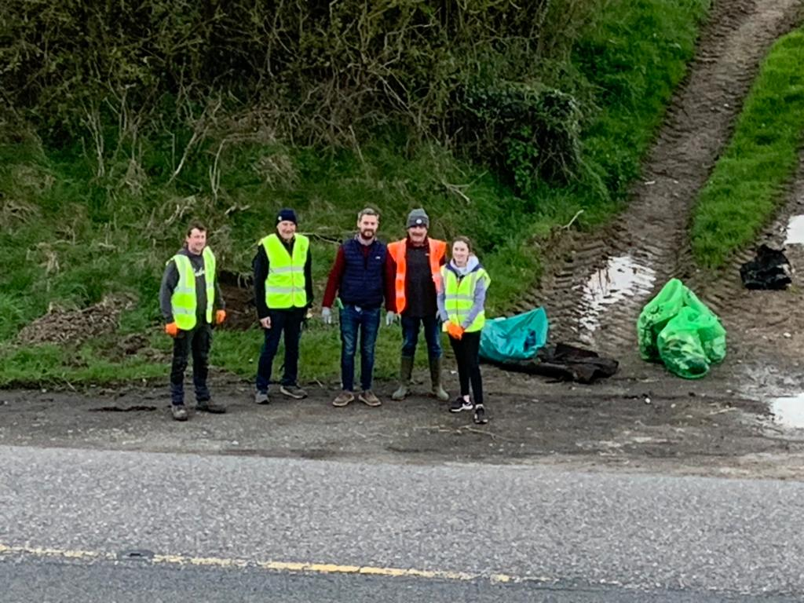

Volunteers were out on four evenings in April and got through the bulk of the litter in the village and along the surrounding approach roads. The village itself was mostly the usual everyday bits and pieces. The approaches were a different story. Illegal dumping is a sad regular occurrence out there and this year was no exception.

Acting on the 2025 adjudicator's recommendation, we made a proper effort this time to separate out recyclables at the point of collection rather than sending everything to landfill. Bottles, cans and anything clean enough went into one set of bags, the rest into another. A lot of what came off the dumped piles was beyond saving, but we recycled what we could.

