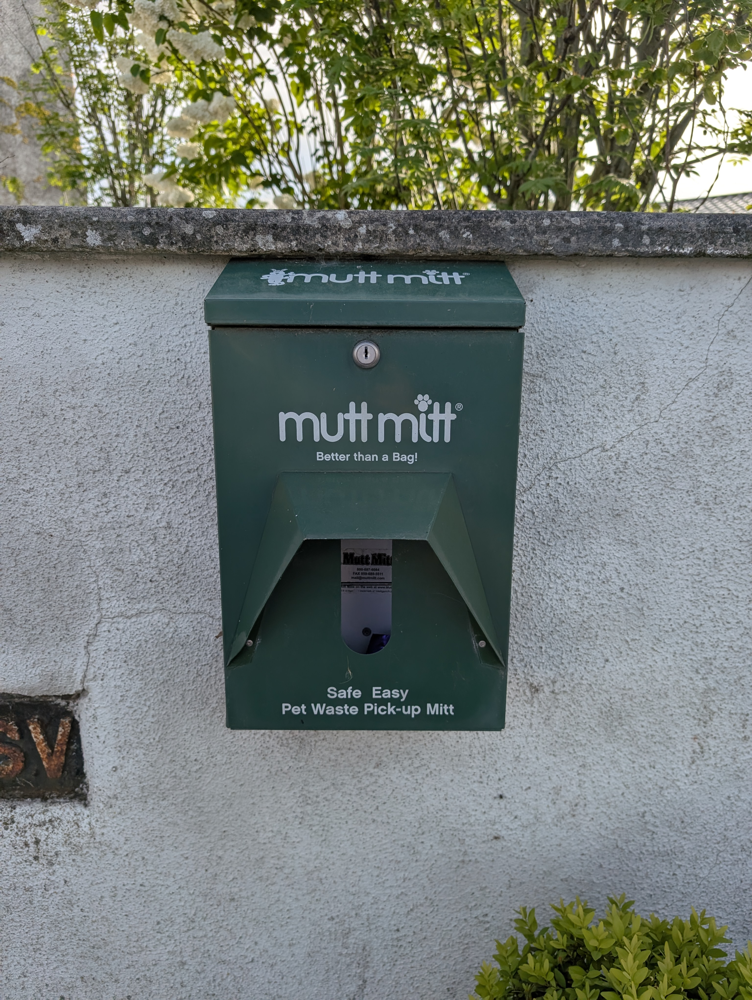

The adjudicator found the dispenser empty when they called in during 2025. It has since been restocked, however in no time it has been emptied again. Councillor Sean Ryan has kindly offered to get a large stockpile for us from Clonmel (Pending as of May 2026).

<figure markdown>
{ width="500" }
<figcaption>The dispenser back on the wall at the monument area, restocked and on the volunteer round (May 2026)</figcaption>
</figure>

