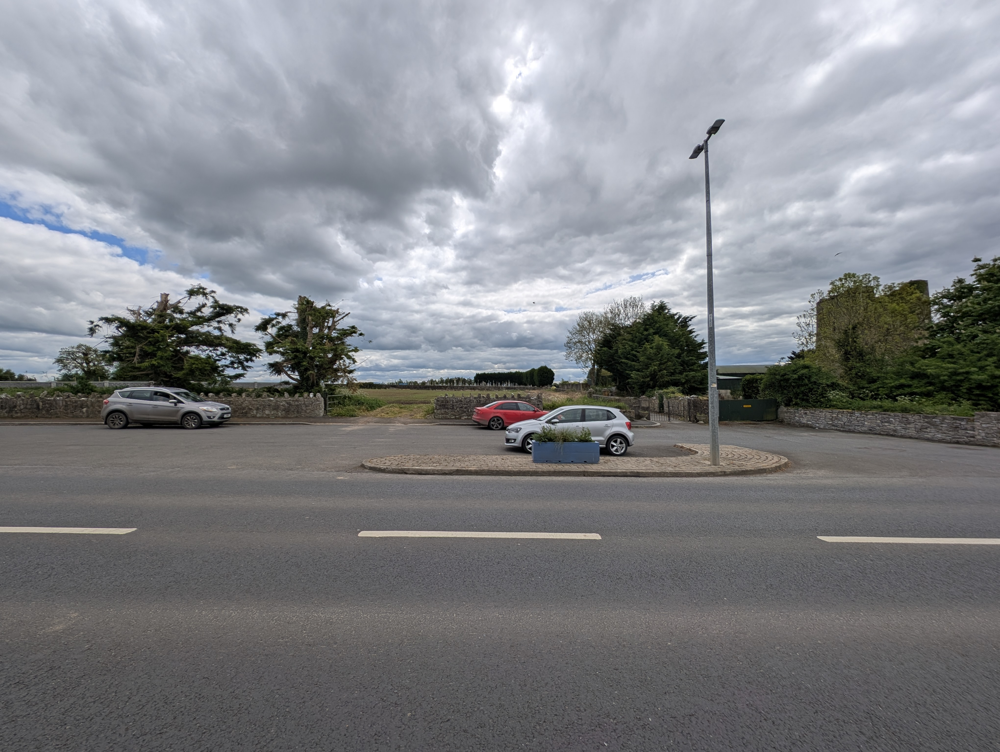
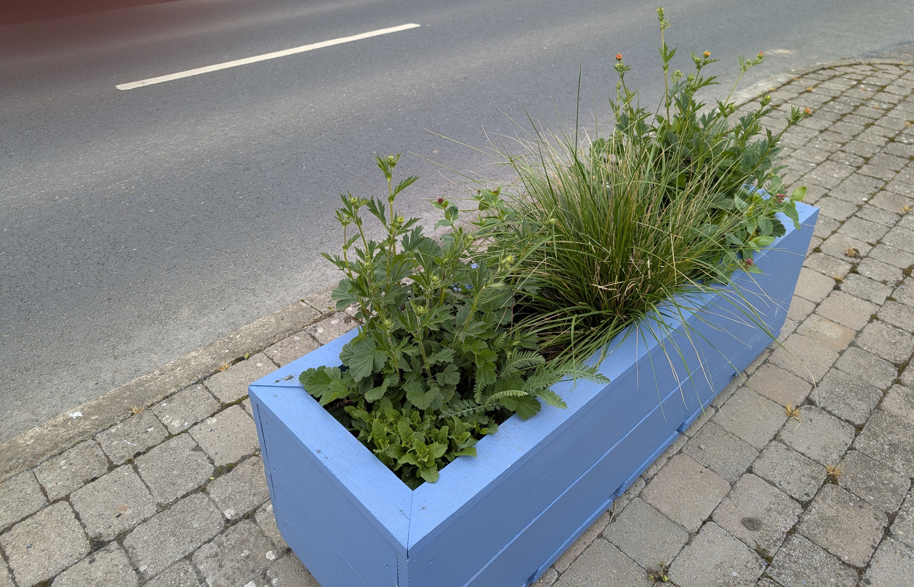
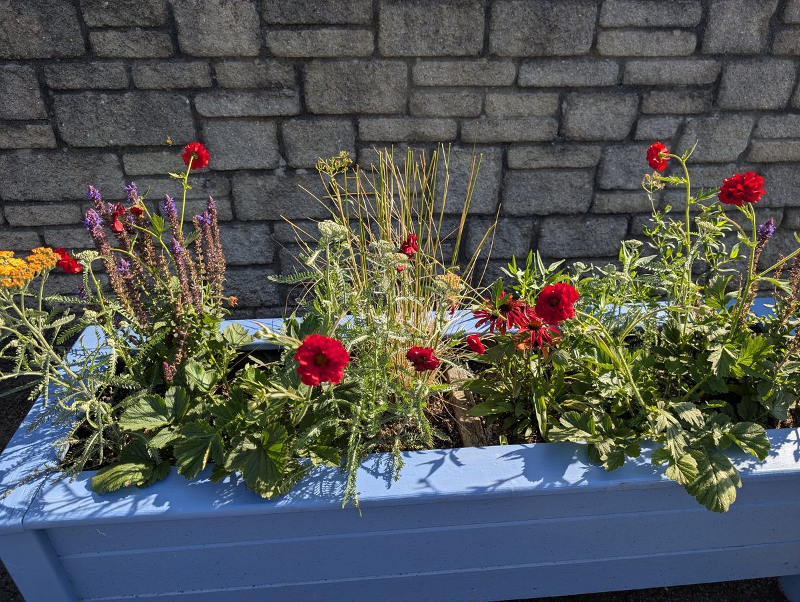
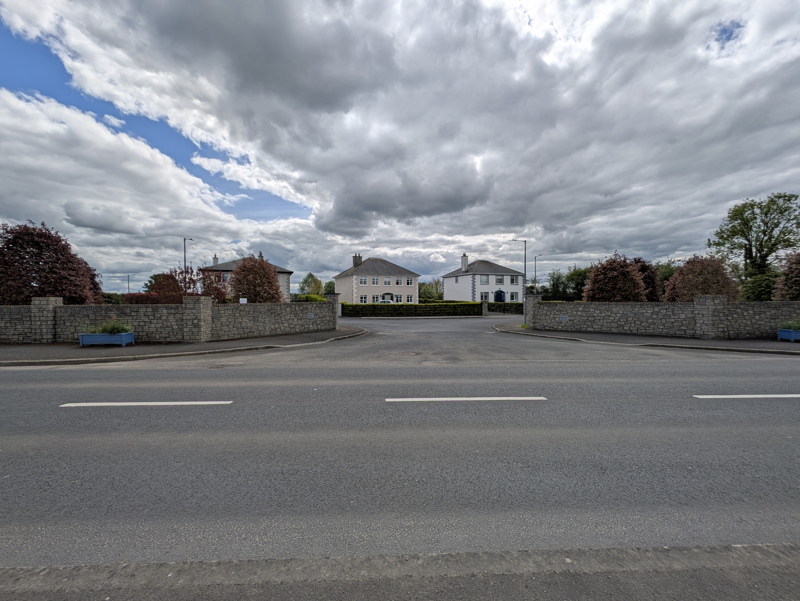
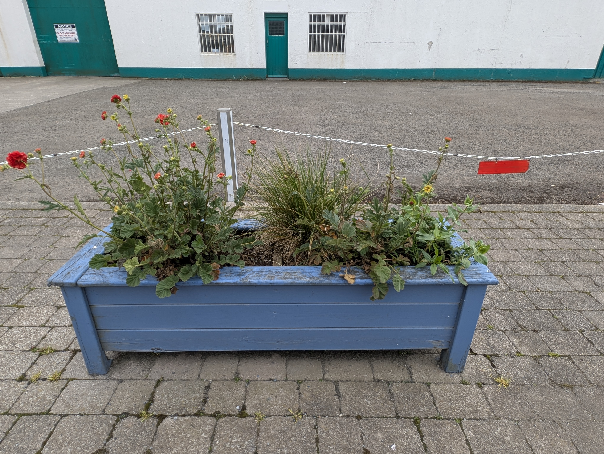
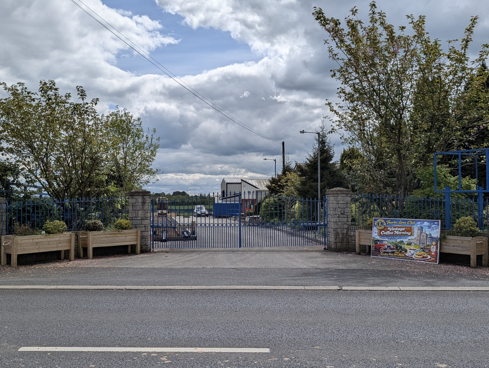
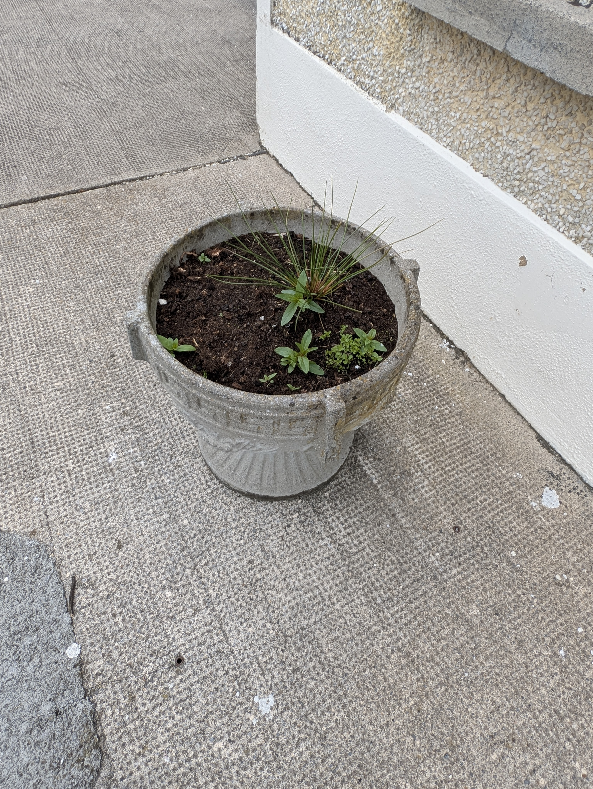

A **cohesive village-wide planter scheme**, locally crafted blue wooden trough planters in a unified colour, filled with split perennials we propagate ourselves rather than annual bedding bought in every year. The planters tie the village together visually, dramatically improve the pollinator value of every container, and bring planter maintenance back in-house. Adjudicators in both 2024 and 2025 asked us to move planter species away from purely ornamental annuals towards pollinator-friendly perennials, so we did.

  <figure>
    
    <figcaption>The parking layby in front of the cemetery with our two blue planters either side, framing the spot. The Norman Blackcastle ruin is visible just beyond on the right (May 2026)</figcaption>
  </figure>
  <figure>
    
    <figcaption>One of our blue trough planters at the cemetery layby. Locally sourced wood, made by a local tradesman, part of the cohesive village-wide scheme (May 2026)</figcaption>
  </figure>
  <figure>
    
    <figcaption>The Meadow Brook planters in full flower! Gorgeous Geum, Achillea, Salvia and Deschampsia really filling out nicely (July 2025)</figcaption>
  </figure>
  <figure>
    
    <figcaption>Wide view of the Meadow Brook entrance, the Copper Beech avenue inside the wall and a pair of our cohesive village planters either side of the entry (May 2026)</figcaption>
  </figure>
  <figure>
    
    <figcaption>Our blue trough planter at the Dempsey & Harold Motors site, planted up with red Geum, ornamental grass and a mix of perennials (May 2026)</figcaption>
  </figure>
  <figure>
    
    <figcaption>The Transport Museum gates dressed up for our Vintage Coffee Morning, with the wooden planters either side echoing the village planter scheme (May 2026)</figcaption>
  </figure>
  <figure>
    
    <figcaption>An older concrete planter in front of Corcoran's. We're letting the existing annuals die back and filling these with split perennials from our own beds. No waste, no annual spend, much better for pollinators (May 2026)</figcaption>
  </figure>

## What the adjudicator asked for

Both the 2024 and 2025 adjudicators recommended transitioning planter species away from purely ornamental annuals towards pollinator-friendly perennials. The repeated recommendation made it a priority to act on.

## What we did

A real Phase 1 investment went into the **locally crafted blue wooden trough planters** themselves, built from solid wood by a local tradesman. We chose to spend properly on the containers because they're a piece of the village's streetscape for the next decade or more, and locally made wood we can repair and replace beats imported plastic every time. The pairs now anchor the cemetery layby, the Meadow Brook entrance, the Transport Museum gates and the Dempsey & Harold Motors site, with more going in as older plastic planters reach end-of-life.

For the planting itself, we deliberately picked **clump-forming pollinator perennials we knew we could divide**. That means we're propagating new stock from our own existing village beds every couple of years rather than buying bedding plants in. The ongoing cost drops to almost nothing, the plants get more established each year, and the pollinators get continuous flowering from late spring through summer instead of a six-week annual bedding hit.

We're not ripping anything out. Where there are existing annuals or non pollinator friendly perrenials in the older planters we're letting them die back naturally and filling the gaps with split perennials as the seasons turn. By the time the next adjudication comes around the whole village will be running on the same pollinator-friendly mix.

## What we planted, and why

| Plant | Role in the scheme |
|---|---|
| **Geum 'Mrs Bradshaw'** | Ruffled scarlet doubles flowering from May. Brings the red of the village flag. Divides easily. |
| **Achillea 'Coronation Gold'** (Yarrow) | Flat plates of deep yellow for the yellow of the village flag. Garden form of our native Yarrow, brilliant for hoverflies and bees. Easy to split. |
| **Echinacea** (red varieties) | Big daisy-like flowers with cone centres, a late-summer pollinator magnet. Reinforces the red. Clump-former that divides every two or three years. |
| **Salvia 'Caradonna'** | Almost-black stems with deep violet-purple spikes. Bumblebee magnet, long flowering, splits cleanly. |
| **Red Valerian** | Light pinky-red panicles, the same plant you see growing wild on stone walls all over Ireland. Drought-resistant, brilliant for butterflies, divides readily. |
| **Deschampsia 'Goldtau'** (Tufted Hair Grass, "Gold Dew") | Native ornamental grass with airy golden seed plumes for structure and seasonal movement. Splits readily. |

Three things drove every choice:

- **Pollinator-friendly first.** Every plant in the mix earns its keep on the [All-Ireland Pollinator Plan plant list](https://pollinators.ie/plants/). We're following the national guidance rather than guessing.
- **Splits easily.** Every variety is a clump-former we can divide ourselves. That's how we keep ongoing cost down to almost nothing while the display gets bigger and better every year.
- **Red and yellow as the core colours.** Those are our village flag colours, the same red and yellow that fly on the GAA monument at the centre of the village. The Geum, Echinacea and Red Valerian all bring the red, the Achillea brings the yellow, and the planter scheme quietly ties in with the village's own identity.

## Best practice we leaned on

The [All-Ireland Pollinator Plan - Pollinator-friendly Plants](https://pollinators.ie/plants/) gives a curated list of native and near-native plants that support pollinators across the growing season. The principles we worked to:

- Native perennials over annual bedding.
- Simple, open flowers accessible to short-tongued bees.
- Continuous flowering from March through to October, no hungry gaps.
- No double-flowered or highly bred cultivars (they often have little or no nectar and pollen).
