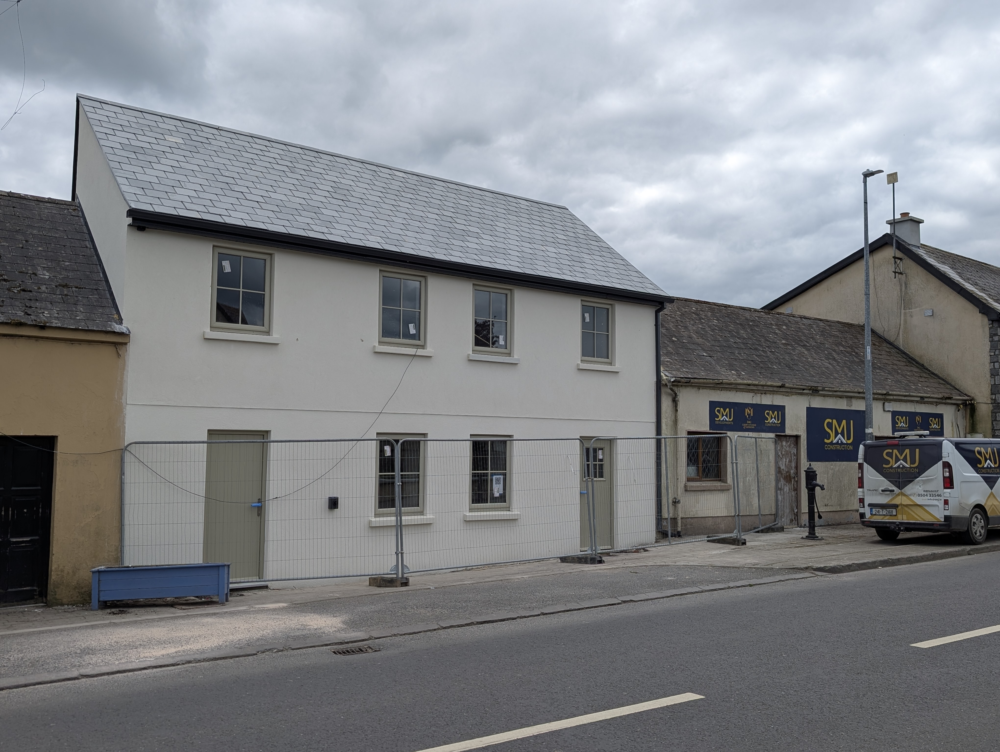
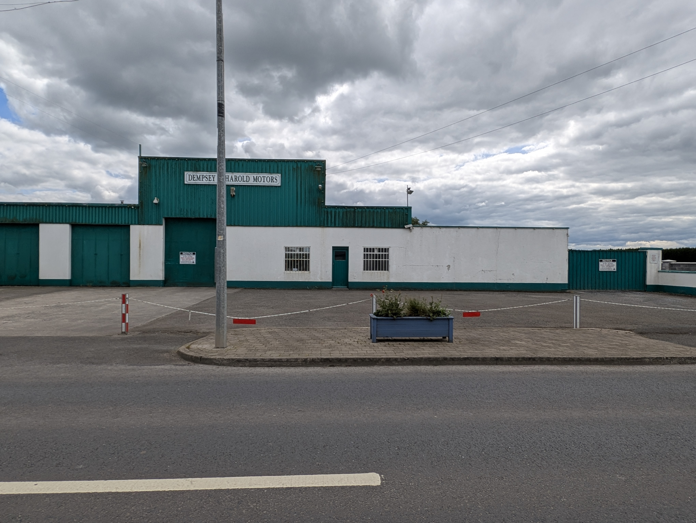
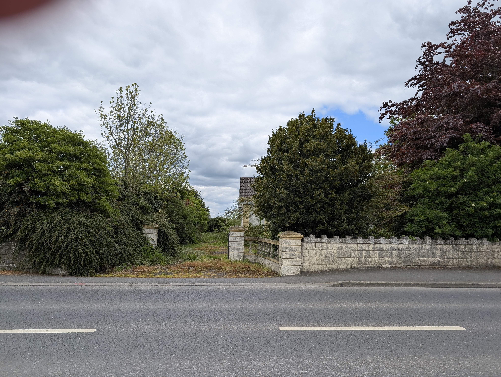

The 2025 adjudicator asked us to do something about the look of derelict buildings around the village. We can't make property owners refurbish, but a few good things have happened this year that we're delighted about.

SMJ Construction (Sean Mockler Jnr) started refurbishing two derelict properties on the main street that were flagged in the 2025 report. A direct response to what the adjudicator asked for and a real lift to the streetscape.

The former Dempsey & Harold Motors site at the western end of the village has been taken on by Roadvacs (Irl) Limited, who are setting up offices and a yard as their new Tipperary base. Another main building back in active use.

We also reported a derelict house opposite the cemetery on the L4202 to Tipperary County Council, where overgrowth was spilling onto the public footpath.

Three properties moving in the right direction. About as much as a community group can do on this one, and the committee will keep an eye on the rest.
