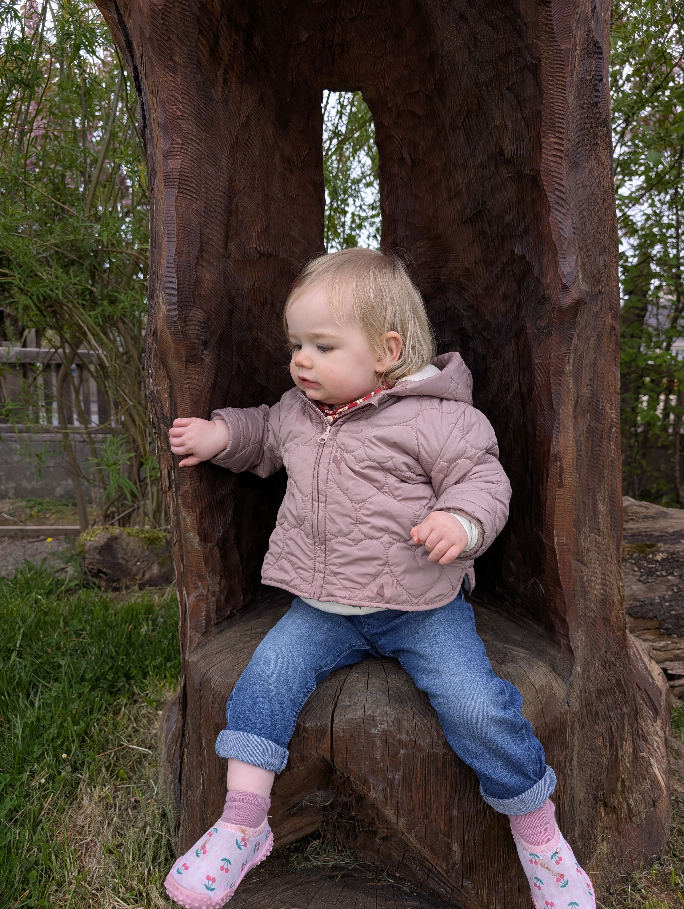

The 2025 adjudicator flagged blocked paths and damaged timber. Spring 2026 we got stuck in: Michael Maher did an almighty job applying 2 coats of protective oil to all the wood. We repaired some damaged elements with locally sourced wood. Gravel paths were cleaned up. Reads as a proper sensory and learning space again. We're delighted with the results.

<figure markdown>
{ width="600" }
<figcaption>One of our youngest volunteers taking a well-earned break on the sensory garden's wooden throne after a hard day's work (April 2026)</figcaption>
</figure>

Companion project: [willow weaving](../048-sensory-garden-willow-reweaving/index.md), first weave delivered March 2026. More photos on the [village map](../../map.md) under sensory garden.
