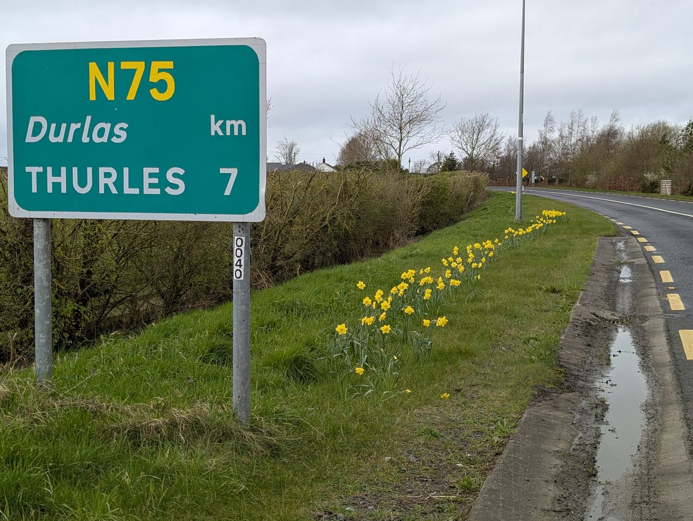
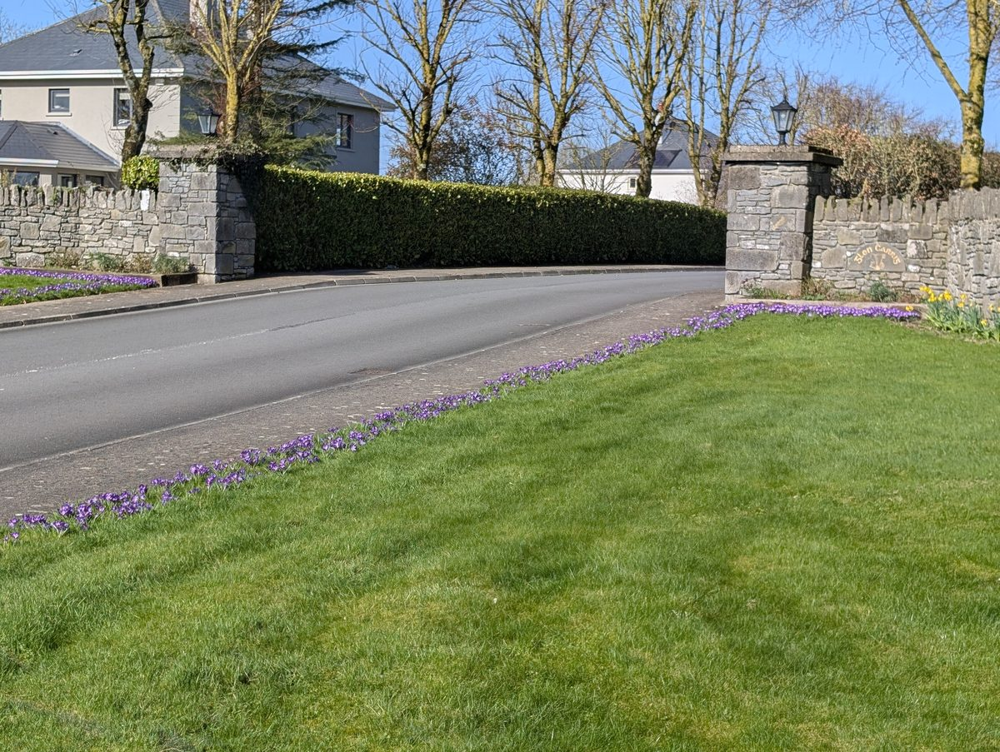
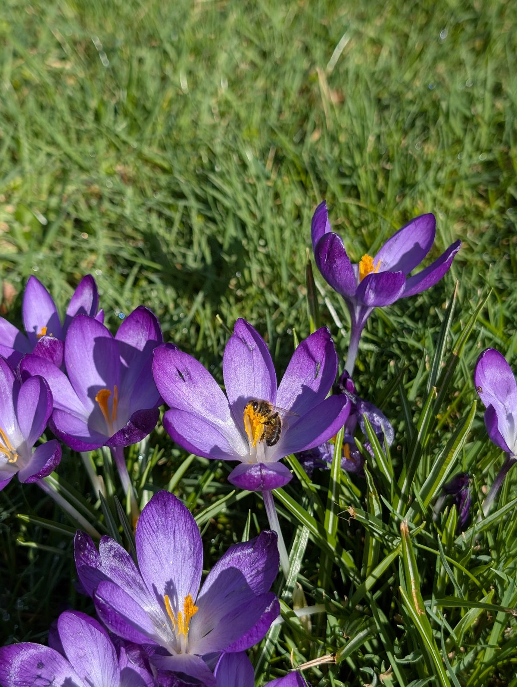
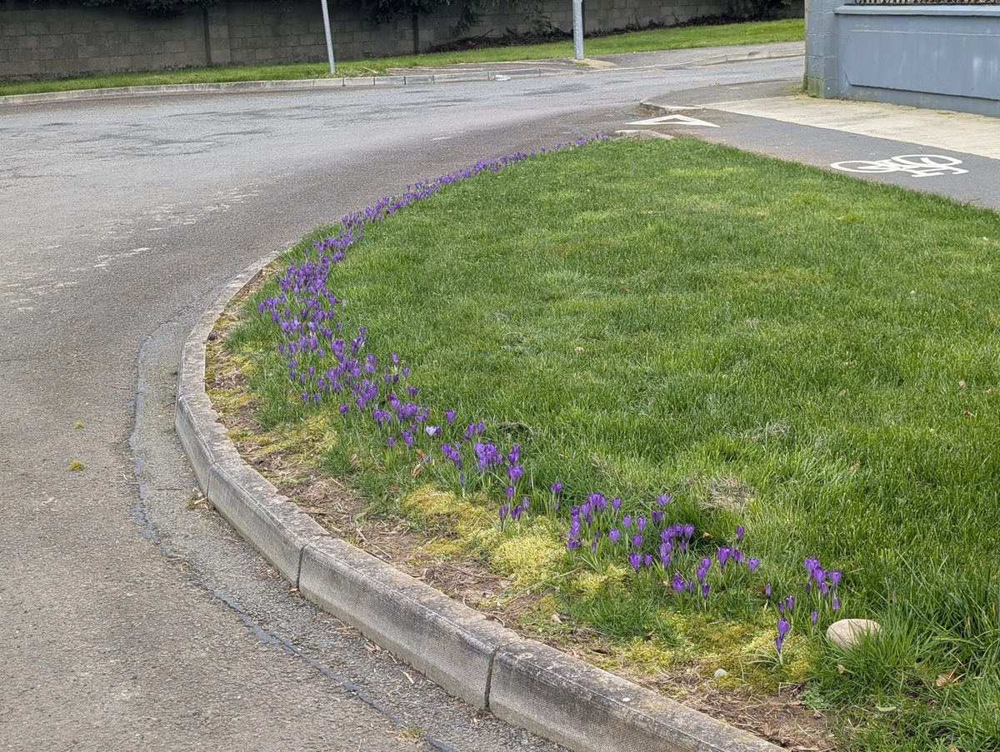
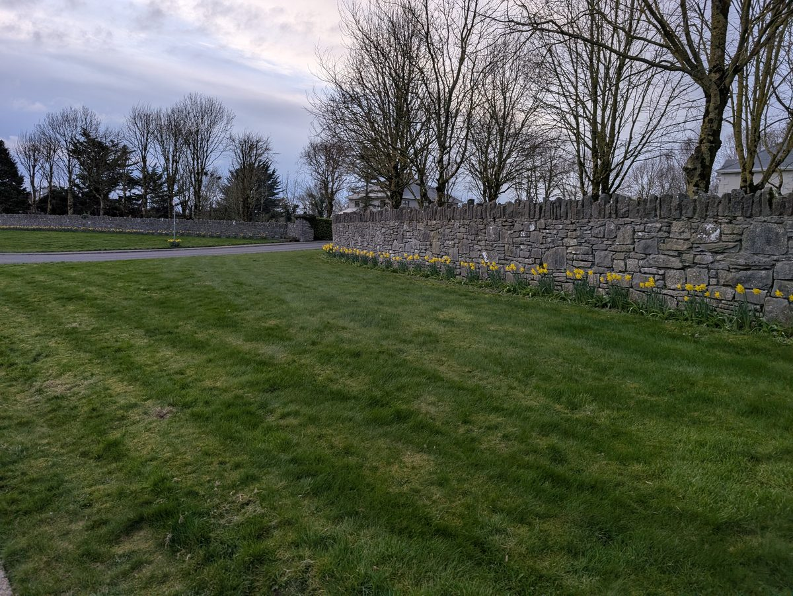
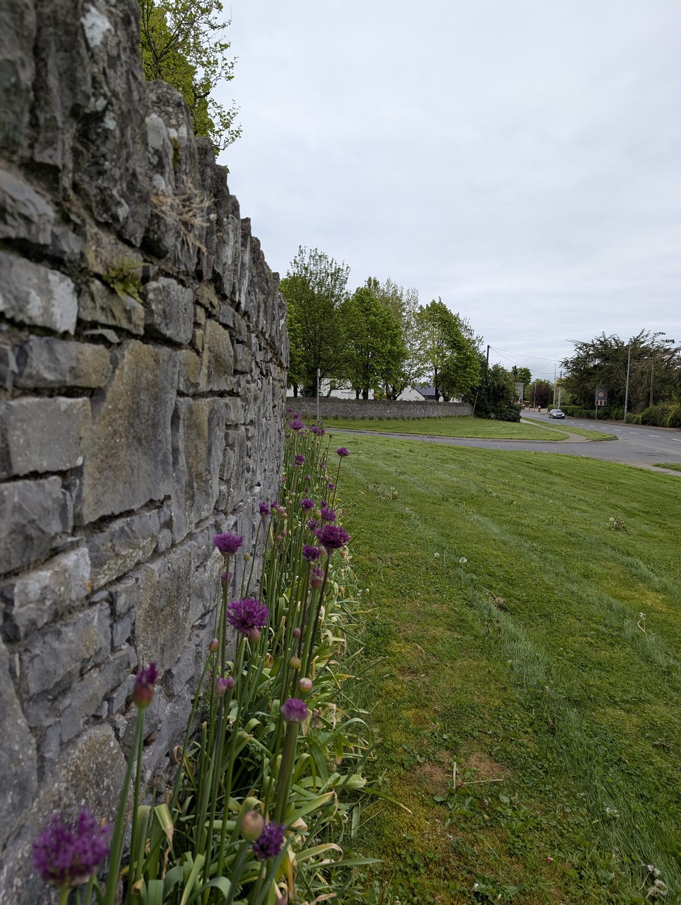
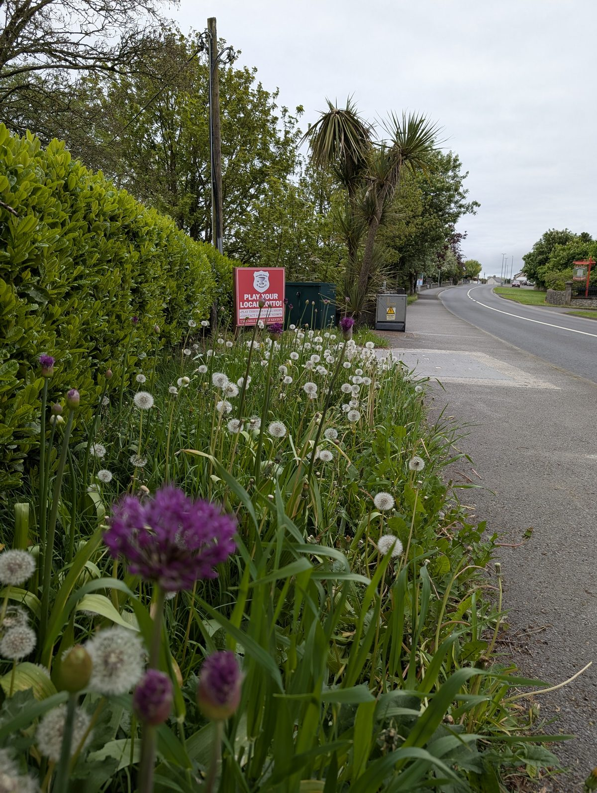
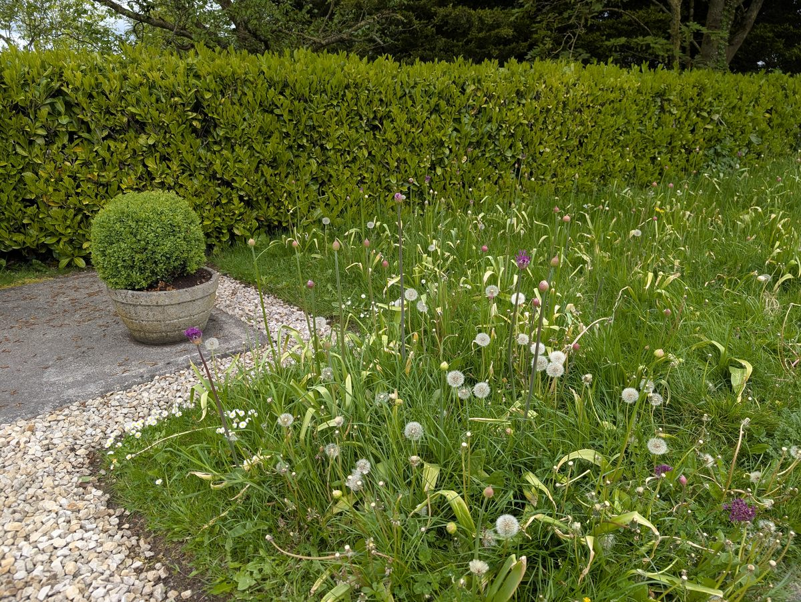
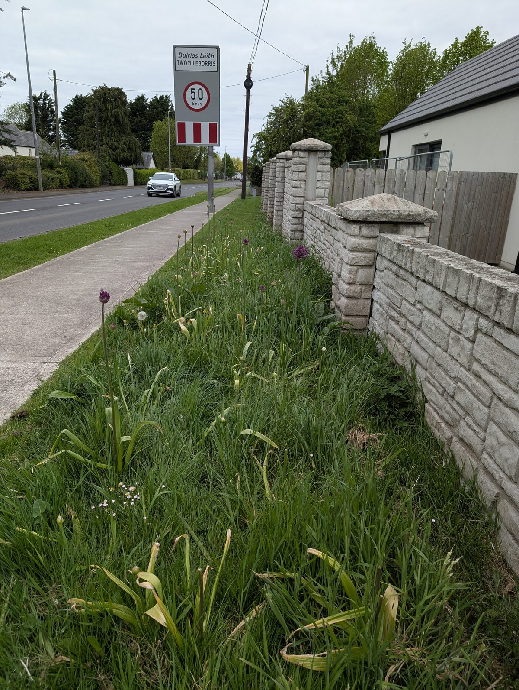

A big planting weekend in autumn 2025, TMB Tidy Towns volunteers joined by 15 volunteers from the residential estates. **11,100 bulbs** went in across the village - the N75 approach road from Thurles, the extended seating area and several estate entrances. The alliums carry the show through May to July, well past the daffodils and crocuses, and the bulbs naturalise so the display comes back stronger every spring.

  <figure>
    
    <figcaption>Dutch Master daffodils brightening up the N75 approach to the village from Thurles direction (March 2026)</figcaption>
  </figure>
  <figure>
    
    <figcaption>Crocuses and daffodils putting on a beautiful show outside Glen Carraig (March 2026)</figcaption>
  </figure>
  <figure>
    
    <figcaption>Honeybee busy foraging on a Ruby Giant crocus, exactly the early-spring fuel pollinators need (March 2026)</figcaption>
  </figure>
  <figure>
    
    <figcaption>Early crocuses along the entrance kerb at Cluain Na Seimre, a gorgeous splash of purple in spring (March 2026)</figcaption>
  </figure>
  <figure>
    
    <figcaption>Cheerful daffodils planted along the limestone wall at Glen Carraig (March 2026)</figcaption>
  </figure>
  <figure>
    
    <figcaption>Stunning Purple Sensation alliums in full bloom along Glen Carraig's limestone wall (May 2026)</figcaption>
  </figure>
  <figure>
    
    <figcaption>Purple Sensation alliums alongside the dandelion clocks at the village seating area (May 2026)</figcaption>
  </figure>
  <figure>
    
    <figcaption>Dandelion clocks and Purple Sensation alliums weaving together at the seating area (May 2026)</figcaption>
  </figure>
  <figure>
    
    <figcaption>Purple Sensation, Nigrum alliums and daffodil foliage making a lovely display at Leighton Manor (May 2026)</figcaption>
  </figure>

## Why these bulbs

We wanted bulbs that would reward us for years, not just one spring, and that would actually help the bees and butterflies rather than just look pretty. So we leaned heavily on the [All-Ireland Pollinator Plan plant list](https://pollinators.ie/plants/) when picking what to put in the ground.

Three things drove every choice:

- **Pollinator value first.** Crocus is one of the very first nectar sources of the year (you can see the honeybee tucked into one of them in the carousel), daffodils bridge into early spring, and the alliums then carry pollinators all the way from May into July. Together they fill what would otherwise be a hungry gap in the village.
- **Full-sun and roadside-tough.** Most of our planting spots are open verges, estate entrances and the N75 approach. All five varieties cope happily with full sun, free-draining roadside soil and the occasional bit of salt spray, which a lot of fancier garden bulbs simply can't.
- **Plant once, enjoy for years.** Every variety we chose naturalises, meaning the clumps spread and multiply on their own. No annual replanting, no annual replacement cost. The €1,143 we spent in autumn 2025 should keep delivering a bigger and better display every spring for at least a decade. That's about as low total cost of ownership as bulb planting gets.

## Sitting beautifully alongside the wildflowers

What's made us absolutely delighted this spring is how the bulbs look against what was already there. The Purple Sensation alliums standing up among the dandelion clocks at the seating area is genuinely one of the prettiest things in the village right now, the soft white clocks catching the light behind those bold purple globes is a picture. The same thing is happening at Leighton Manor where the alliums are weaving through the chamomile and native grasses on the [unmown verge strips](../009-unmown-verge-strips/index.md).

It's a really nice payoff for the [no-mow approach](https://pollinators.ie/grasslands/) we've been taking. We resisted the urge to "tidy up" the verges and the dandelions, and the bulbs we added on top have made the whole thing look intentional rather than scruffy. Pollinator-friendly and lovely to look at, which is exactly the combination we were hoping for.

## What we planted

| Qty        | Variety                          | Size  | Cost       |
|------------|----------------------------------|-------|------------|
| 1,600      | Dutch Master daffodils           | 14/16 | €192.00    |
| 1,000      | Purple Sensation alliums         | 12/14 | €144.00    |
| 1,000      | Nigrum alliums                   | 12/14 | €120.00    |
| 5,000      | Ruby Giant crocus                | 7/8   | €215.00    |
| 2,500      | Drumstick alliums                | 7/8   | €100.00    |
| **11,100** | **Subtotal**                     |       | **€771.00**|

Shipping €236.50, tax €136.01. Grand total **€1,143.51**, split between TMB Tidy Towns and the participating estates. The committee's share came in at roughly **€320 inc. VAT and delivery**, with the estates picking up the rest in proportion to the bulbs that went into their ground.
