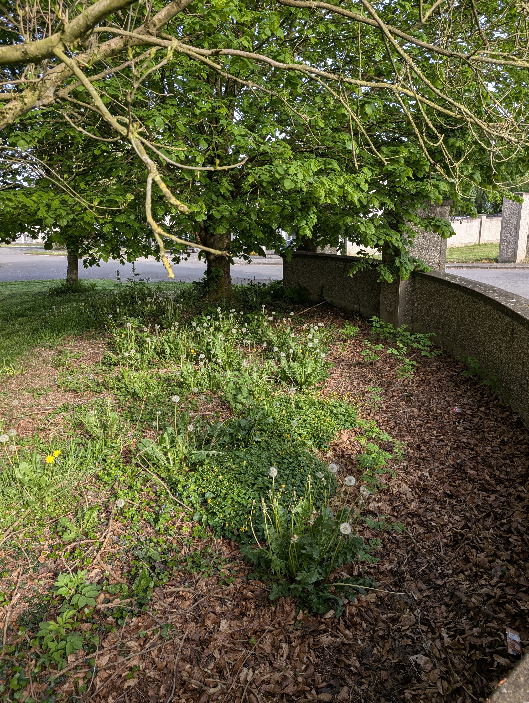

## Description

Establishing a linked biodiversity corridor through the village with native tree planting would provide long-term habitat value, improve air quality, and contribute to the village's resilience to climate change. Native trees such as rowan, hawthorn, and whitethorn support far more insect species than ornamental non-natives. The 2025 adjudicator recommended increased tree planting as part of a broader biodiversity strategy.

## What the adjudicator said

The 2025 adjudicator recommended that the village pursue additional tree planting as part of its long-term biodiversity strategy, noting the value of native species for supporting local wildlife.

## Best practice & research

The [All-Ireland Pollinator Plan - Trees & Hedgerows](https://pollinators.ie/trees-hedgerows/) recommends:

- Prioritise native tree and shrub species over ornamental non-natives
- Hawthorn, blackthorn, rowan, willow, and wild cherry are among the most valuable for pollinators
- Avoid clipped formal hedges where possible, allow flowering to support bees
- Connect planted areas to form corridors rather than isolated islands of habitat

## Candidate sites

- **Fanning Park entrance**, a mature flowering Hawthorn already anchors the corner; flagged on the village walk in May 2026 as a strong link in the corridor.
- **Castlepark entrance corner**, a mature Sycamore canopy with a curving bark-mulched border underneath where Dandelions, Cow Parsley and other native wildflowers come up naturally each spring. A working template for the kind of low-cost, high-value biodiversity stitching we want at every estate gate around the village.

<figure markdown>
{ width="600" }
<figcaption>The Castlepark entrance corner: mature Sycamore canopy, bark-mulched curving border, native wildflowers coming through naturally from the seed bank. This is the template (May 2026)</figcaption>
</figure>

