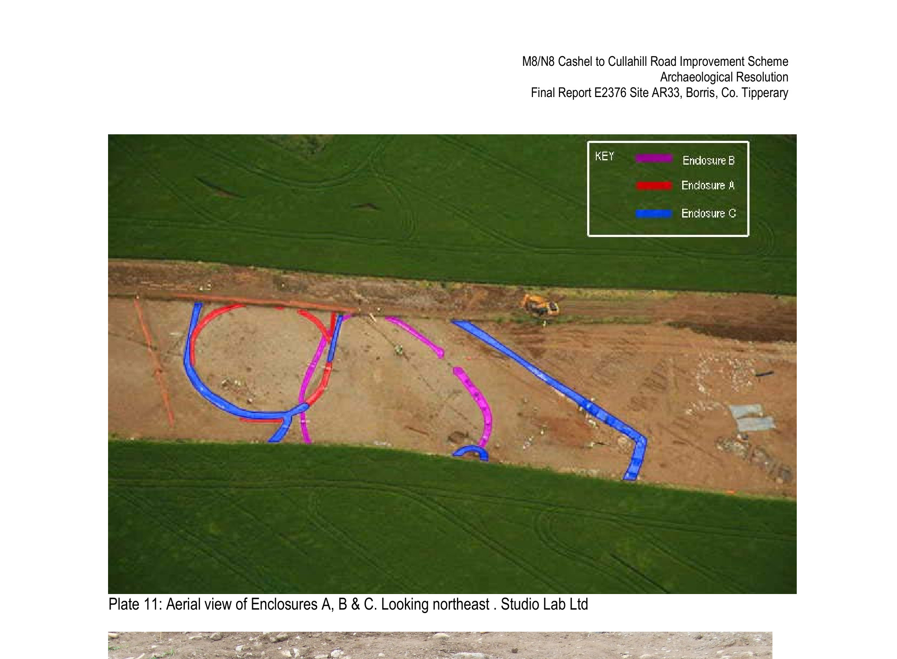
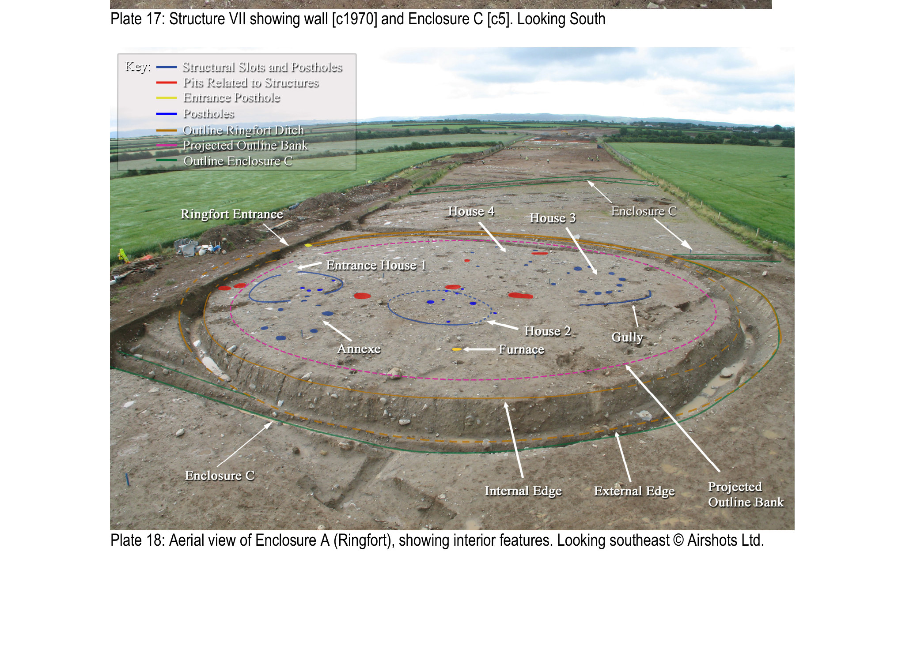
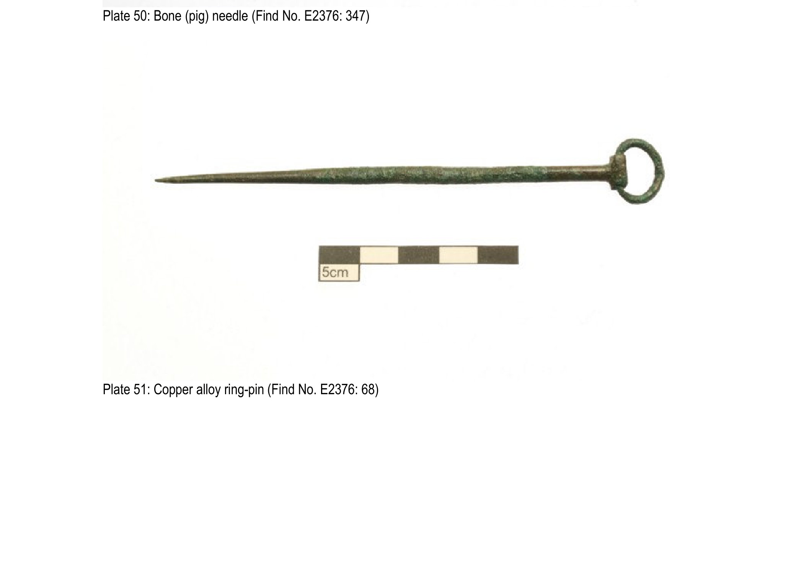

# Early Medieval Two Mile Borris

*AD 450 – 1169*

After the relatively quiet Iron Age, the early medieval period in Ireland saw a serious expansion of farming, a much denser population, and from around AD 600 onward the rise of the ringfort as the dominant settlement type. People in Two Mile Borris built three different enclosures here in succession over five hundred years, each one a slightly different answer to the same questions: how much do you defend? how big a household do you accommodate? where do you bury your dead?

*Aerial view of Enclosures A, B and C at AR 33: the early medieval plectrum-shaped enclosure (B), the overlying ringfort (A), and the later rectangular expansion (C). Photo: Studio Labs / Valerie J. Keeley Ltd / TII (placeholder).*

Most of what we now know about early medieval Two Mile Borris comes from a single excavation: [Site AR 33](../places/dig_ar33.md) on the east-facing slope above the Black River. The dig found three phases of enclosure (called Enclosures A, B and C by the team) one replacing or growing out of another over centuries, and a small cemetery of family and neighbours laid to rest just outside the working ringfort.

## Phase 1: Enclosure B, the plectrum-shaped enclosure

<h3>An unusual stockaded settlement</h3>

Fifth to eighth century AD

The first early medieval enclosure on the site was an unusual oval shape, with one straight or slightly indented side, that the excavators compared to the shape of a guitar plectrum. The ditch was U-shaped in profile, around a metre wide and two-thirds of a metre deep on average, with the digging slightly more substantial near the entrance.

Two big post-holes flanked the entranceway, with three smaller ones between them and a 1.3 metre gap left as the actual opening. Inside the enclosure, post-holes traced the line of an internal palisade, a second timber barrier just inside the ditch. So this was a defended, inward-looking settlement, not just an animal pen.

Inside, a circular timber structure 5.5 metres across, and 27 pits scattered through the interior used for hearths, storage and roasting. Finds from the ditch and pits include a handle made from red deer antler, a ceramic crucible for melting metal, iron-working residues, and a substantial amount of animal bone.

??? note "Why is the shape interesting?"

    Plectrum-shaped enclosures are rare. The closest comparison is one excavated at Newtown, Co. Limerick. The Newtown one stayed in use right through the period when classic round ringforts were being built, but at Two Mile Borris our plectrum enclosure was abandoned and a ringfort was built right over the top of it. So we have a snapshot of two different settlement traditions, one giving way to the other.

## Phase 2: Enclosure A, the ringfort

*Aerial of Enclosure A, the ringfort, at AR 33, showing the four roundhouse footprints inside, looking southeast. Photo: Airshots Ltd / Valerie J. Keeley Ltd / TII (placeholder).*

<h3>A textbook ringfort with a textbook house</h3>

Seventh to twelfth century AD

After Enclosure B fell into disuse and its ditch had silted up naturally, a classic round ringfort was built over the top of its northern half. The ringfort ditch was V-shaped in profile, 1.35 metres wide and 0.7 metres deep on average. The east-facing entrance was 3.2 metres wide, with at least one large post-hole framing it.

Inside the ringfort, four circular structures, defined by post-holes and (in two cases) shallow curving gullies. From the ditch came several iron knives, a fragment of a quern-stone for grinding grain, a glass bead, a stone gaming-board, a copper-alloy ringed pin, and 26 kilograms of animal bone.

??? note "The house that matches the law book"

    One of the four houses inside the ringfort, called Structure 2 on the dig, lines up almost word-for-word with a house type described in the Críth Gabhlach, an early Irish law-tract about social status. The law-tract describes the *tech ninicas* as "seventeen feet in diameter", with the interior split in half — a bed cubicle (*imdae*) on one side and a paved floor (*plait*) on the other.

    Structure 2 was 5.2 metres in diameter (which is exactly 17 feet), and the northern half of the interior had a cobbled floor surface. Half cobbled, half not, exactly like the law book says. Reading the textbook description and looking at the excavated floor side by side, it lands.

![Metalworking hearth feature [c130] inside the ringfort](../assets/map-data/photos/dig_ar33/plate22-metalworking-hearth.jpg)
*Iron-working hearth [c130] inside the ringfort, dated 680-774 AD. Photo: Valerie J. Keeley Ltd / TII (placeholder).*

## Phase 3: Enclosure C, the rectangular expansion

<h3>The settlement grows into something bigger</h3>

Later phase, reusing the ringfort as part of a larger enclosure

In the third and final phase, the ringfort kept being used, but now as one corner of a much larger rectangular enclosure. The northern part of the original ringfort ditch was widened and deepened, and the rest of Enclosure C extended outwards, around 87 metres north-south by 55 metres east-west. Geophysical survey showed that almost half of Enclosure C extended beyond the road corridor and was never excavated.

Inside Enclosure C the dig found an iron furnace, a smithing hearth, two cereal-drying kilns, several pits, a four-post structure (probably a granary), and two more circular buildings. Plus two more iron knives, metallurgical residues, and another large dump of animal bone.

This is a working farm and craft centre, not just a defended household. The bigger footprint allowed more activities to happen inside the perimeter.

## The early medieval cemetery

![Burial SK1 [c1001], an elderly male, being excavated at AR 33](../assets/map-data/photos/dig_ar33/plate35-elderly-male-burial.jpg)
*Excavation of Burial SK1 [c1001], an elderly male, in the 11th-century cemetery at AR 33, looking west. Photo: Valerie J. Keeley Ltd / TII (placeholder).*

Just outside the enclosures, on the line of the long-abandoned plectrum (B) ditch, the dig uncovered an 11th century inhumation cemetery: 18 east-west burials in shallow unlined graves, plus 2 further isolated burials nearby. The dead were arranged east-to-west which is characteristic of the period, and the age range covered men, women and children.

*The copper-alloy ring-pin (Find E2376:68) from the AR 33 cemetery, recovered tucked beneath the vertebrae of an adult woman's neck. Photo: Valerie J. Keeley Ltd / TII (placeholder).*

One adult woman had been buried with the copper-alloy ring-pin shown above tucked beneath the vertebrae of her neck. Whether that was a brooch fastening her clothing for burial, or a personal possession placed with her, is hard to know.

The interesting thing is the *closeness*: the burials sit right beside the working settlement. People in this period clearly didn't see a hard line between the living and the dead. The dead stayed part of the community. Burial within the settlement, rather than in a separate consecrated graveyard, is now recognised as a much more widespread early medieval practice than it used to be.

## The Liathmore connection

Burial moved at some point in this period. Settlement-cemeteries like ours gave way over time to burial in larger community graveyards in consecrated ecclesiastical precincts.

Just 2.2km east of the dig site, on the western edge of the wetland, sits **[Liathmore (Liath Mochoemog)](../places/liathmore.md)**, the early medieval monastic site founded by St Mochoemog, the same saint our village school is named after. The line that runs from the small east-west graves we found in 2007 to the visible Christian cemetery at Liathmore is plausibly the line of a single community deciding, somewhere in the early medieval period, that their dead now belong with the saints.

## What this tells us

Five hundred years of continuous occupation of one south-facing hill above the Black River. A defensive plectrum-shaped enclosure giving way to a textbook ringfort, giving way to a working farmstead with iron furnaces and grain-drying kilns. A house whose dimensions match the *tech ninicas* of an early Irish law book. And a cemetery of family and neighbours laid to rest a few paces from the front door, before the centre of community burial moved up the road to the new monastery at Liathmore.

This is the period that turned this place into a *settled* place.

## Where on the ground

The three enclosures, the four houses inside the ringfort, and the 11th-century cemetery were excavated in 2006-07 at [Site AR 33](../places/dig_ar33.md), in Borris townland, approximately 350-400 metres south-southwest of the modern village. The features were recorded and then built over. There are no upstanding remains and no SMR/RMP record for the excavated complex itself.

Where the community went next, however, is still standing. The Liathmore monastic site lies 2.2 km east of the dig and carries five linked records on the SMR:

| Feature | SMR | Coordinates |
|---|---|---|
| Ecclesiastical site (overall) | TN042-055---- | 52.6702°N, 7.6690°W |
| Larger church | TN042-055001- | 52.6705°N, 7.6686°W |
| Smaller church | TN042-055003- | 52.6698°N, 7.6687°W |
| Round tower foundation | TN042-055002- | 52.6701°N, 7.6688°W |
| Sheela-na-gig | TN042-055004- | 52.6705°N, 7.6686°W |

Place pages: [AR 33 dig site](../places/dig_ar33.md) and [Liathmore Monastic Site](../places/liathmore.md). Wider parish record: [National Monuments Service Historic Environment Viewer](https://maps.archaeology.ie/HistoricEnvironment/).

## Source

The final two-volume report on AR 33 (E2376) is on the [Digital Repository of Ireland](https://repository.dri.ie/catalog/n584bm480). Críth Gabhlach quotation reproduced from Kelly, F. (1998), *Early Irish Farming*, p. 362.

  <a href="../prehistoric/">
    ← Previous era
    Prehistoric (5500 BC – AD 450)
  </a>
  <a href="../medieval/" class="nav-next">
    Next era →
    Medieval (AD 1169 – 1550)
  </a>

