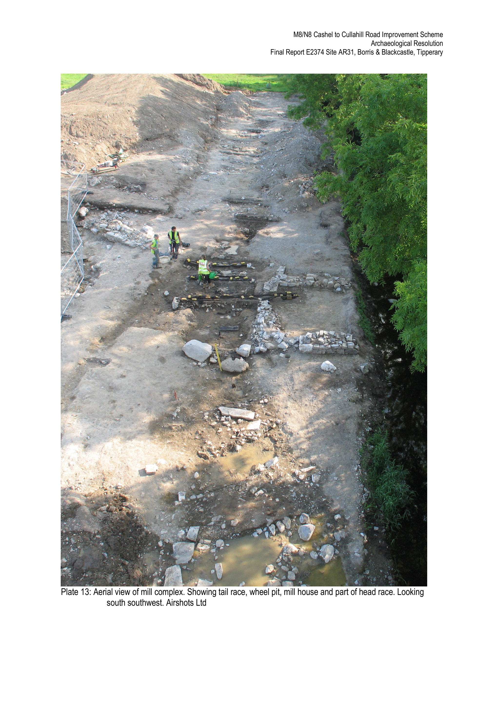
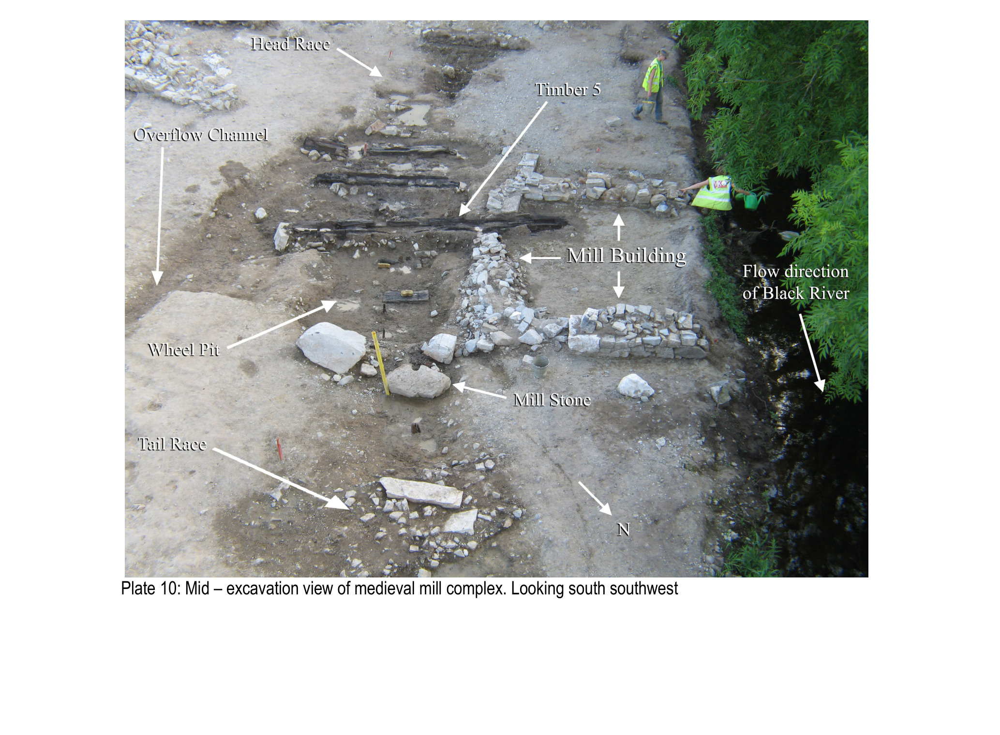
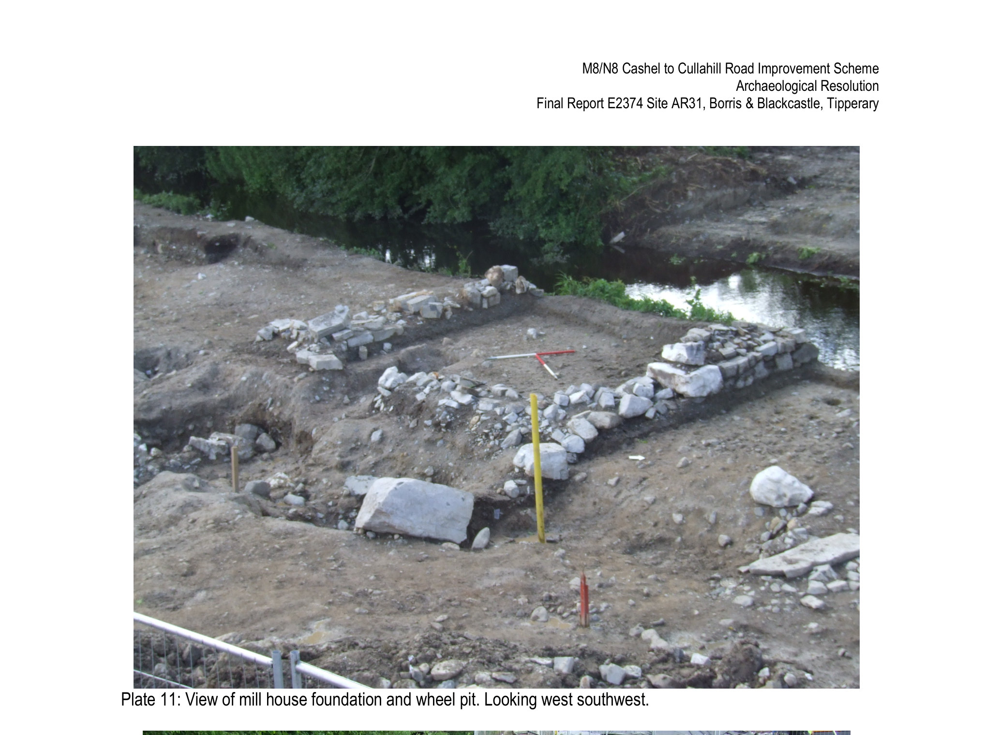
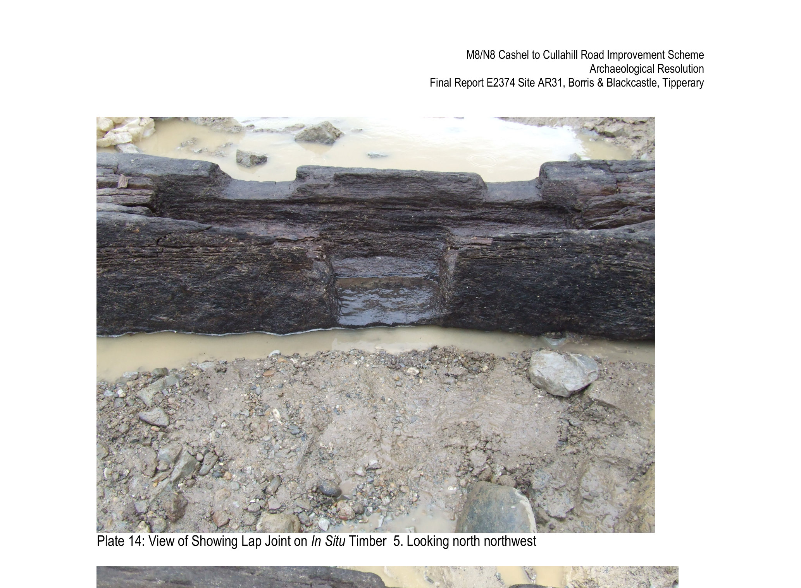
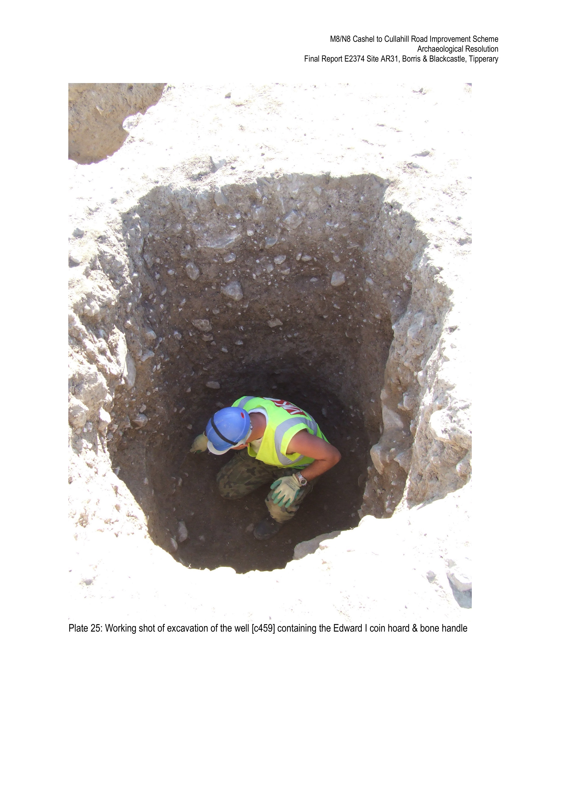
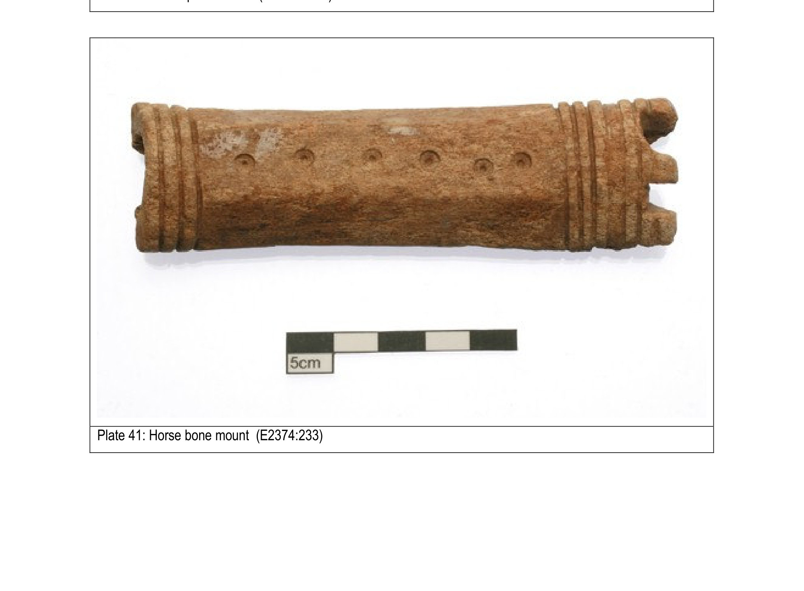
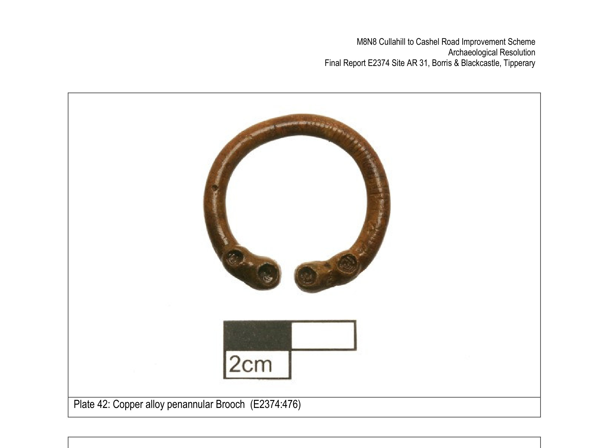
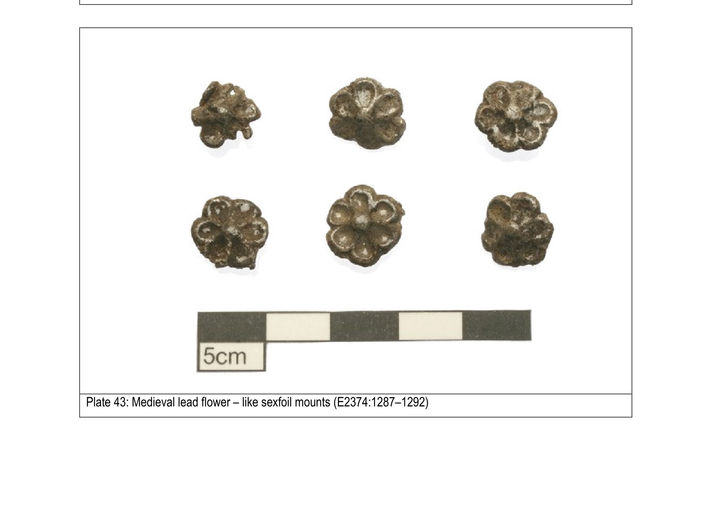
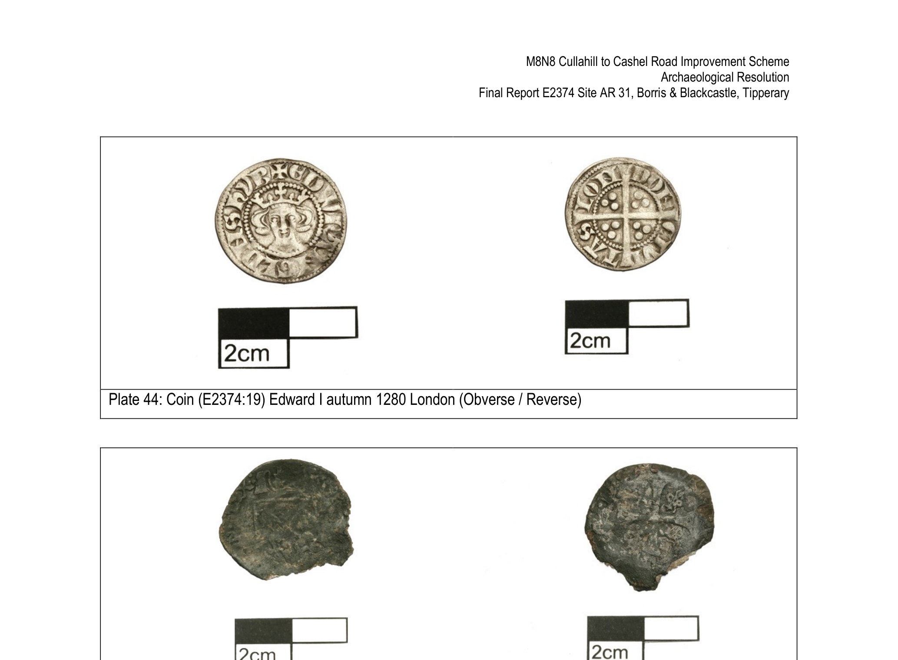
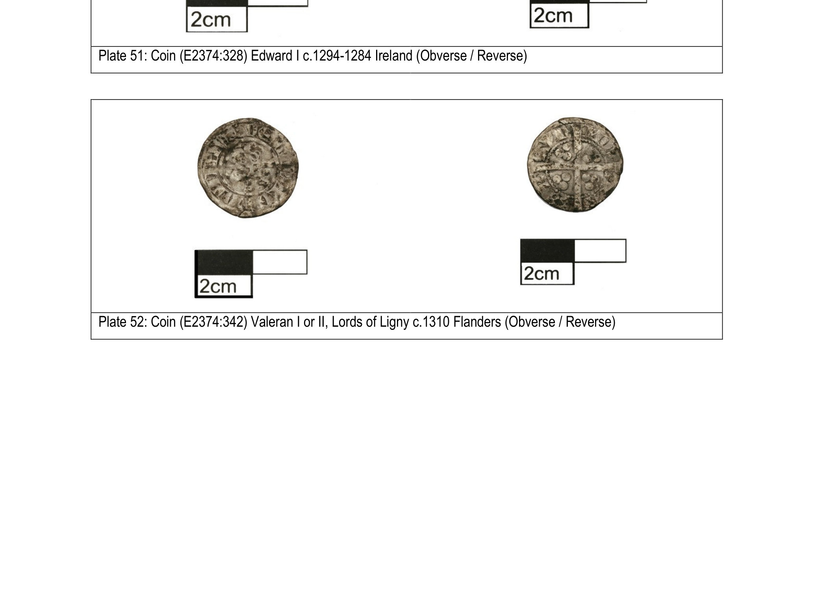

# Medieval Two Mile Borris

*AD 1169 – 1550*

The medieval period in this part of Ireland starts the day the Anglo-Normans arrive. From 1169 onwards a new aristocracy reshaped the landscape, replacing the older Gaelic territories with manors, boroughs and feudal towns, building castles, raising parish churches, draining wetland for tillage. North Tipperary became part of the lordship of Ormond. Two Mile Borris was right inside it, and grew into a chartered borough held in fief by the Archbishop of Cashel himself.

*Aerial of the medieval mill complex at [AR 31](../places/dig_ar31.md), tail race, wheel pit, mill house and part of the head race all visible. Courtesy Airshots Ltd / Valerie J. Keeley Ltd / TII (placeholder).*

The medieval village had what every borough was supposed to have: a row of houses and burgage plots either side of a central street, a parish church and graveyard, a market, and a mill. The dig along the M8/N75 at [AR 31](../places/dig_ar31.md) found the working edge of all of that, just south of where the modern village sits, straddling the Black River.

The [village map](../map.md) shows where everything mentioned on this page sits in the modern landscape, including Blackcastle on the western approach, the parish graveyard at the church, and the AR 31 dig footprint south of the village.

## Buiríos Léith, the medieval borough

Two Mile Borris belonged to the *cantred* (a hundred-village district) of Eliogarty. In 1185, Theobold Walter, founder of the Butler dynasty of Ormond, was granted the cantred. He and his descendants reshaped it. The cantred had probably been coterminous with the older Gaelic territory of *Éile Ua Fogartaigh* (in modern Irish, *Éile Ua Fógartaigh*).

Our modern village is the direct descendant of the medieval borough recorded in the Anglo-Norman documents as *Burgage Leeth*, with the Irish form given as *Buríos leith*. In modern standardised Irish that becomes *Buiríos Léith*, "the grey borough". It was established late twelfth or early thirteenth century. By 1312 it was held in fief by the Archbishop of Cashel, which is to say the senior churchman in the country had a financial and legal interest in this little place.

You can still hear the borough's old name in *Two Mile Borris* itself: *Borris* is the anglicisation of *Buiríos*, the Irish for borough.

## [Blackcastle](../places/blackcastle.md), the upstanding monument

Up on the western approach to the village stands **Blackcastle**, the most visible piece of medieval Two Mile Borris. The Norman tower house gives its name to the surrounding townland, and most of the medieval features the dig found were in fields directly south, in Borris and Blackcastle townlands, within sight of the castle itself.

## The watermills

*Mid-excavation view of the medieval mill complex at [AR 31](../places/dig_ar31.md), looking south-southwest. Courtesy Valerie J. Keeley Ltd / TII (placeholder).*

<h3>Two vertical undershot mills on the Black River</h3>

Early 12th century and early 13th century; large oak timbers preserved in waterlogged conditions

The remains of two mills were one of the headline finds of the dig. A mill was an expensive thing to build and maintain, but a serious revenue earner: tenants were obliged to bring their grain to the lord's mill and pay a tariff for it to be ground. To protect that income, hand-querns were often outright banned in the period.

A northern mill with timbers dated to the early 12th century was followed by a southern mill in the early 13th. The southern one was the better preserved. The dig found its millhouse foundations, a small square stone-walled building, badly truncated by later drainage, and east of it the wheel-pit, with several large oak timbers preserved by the waterlogged ground. The biggest, called Timber 5, was over five metres long and contained dowels and joints. A vertical waterwheel of undershot type would have rotated above it and driven a gear-shaft up to the millstones in the millhouse. A broken millstone was found nearby. Forty-one oak timbers were lifted and analysed in total. The mill house walls stood 6 metres apart, the head race was 25 metres long, the tail race 16 metres.

*Mill house foundation and wheel pit at [AR 31](../places/dig_ar31.md), looking west-southwest. Courtesy Valerie J. Keeley Ltd / TII (placeholder).*

??? note "The Borris Master Chronology"

    Three of the structural oak timbers were sent to David Brown's lab at Queen's University Belfast for dendrochronological dating, and the analysis produced a brand new Irish tree-ring chronology, named the "Borris Master Chronology", running from AD 898 to AD 1176. The three timbers in turn gave estimated felling dates after AD 1118 ± 9, after AD 1188 ± 9, and after AD 1208 ± 9, putting the southern mill's construction firmly in the early 13th century. So the oaks themselves germinated in the late 9th century, grew through the height of the early medieval period, and were finally felled to build the borough's mill at the start of the high medieval period.

*Lap joint on Timber 5, the 5m+ oak from the wheel pit at [AR 31](../places/dig_ar31.md), looking north-northwest. Courtesy Valerie J. Keeley Ltd / TII (placeholder).*

## The cereal-drying kilns

<h3>Three "dumbbell" kilns above the mill</h3>

Medieval; charcoal and carbonised cereal in the fills

About 75 metres east of the mill, on a north-west-facing terrace, the dig found three medieval cereal-drying kilns of "dumbbell" type, all cut into the subsoil with two of them partly stone-lined. Their fills were rich in hazel, willow and oak charcoal and carbonised grain.

Kilns like these had two related jobs: drying grain so it would store and grind safely, and malting barley for brewing ale. So this was the mill, the kilns, and the brewing setup, all on the same patch of ground. The full agricultural and industrial workings of a medieval borough.

The carbonised cereals from the kiln fills were mostly bread/club wheat, oat and barley, with broad/horse bean and field/cultivated pea also showing up in the legume assemblage. People in medieval Two Mile Borris were eating mixed grain and pulses.

## The metalworking complex

<h3>Two furnaces and three smithing hearths</h3>

Medieval; technologically advanced "tapping" furnaces, plus copper-working evidence

To the east of the mill, the team excavated a metalworking area with two iron-smelting furnaces and three smithing hearths. The furnaces were of a more advanced type than the early medieval ones, with a sloping pit at the base to "tap" the molten slag out as it formed, allowing more iron to be smelted in a single firing.

Iron tools, nails and the by-products of metalworking show up across the medieval features here. There was copper-working evidence too, dated AD 1290-1399. The borough wasn't just farming, it was producing in two different metals.

## The rectangular building and the silver coins

*Excavation of the well at [AR 31](../places/dig_ar31.md), where the 57-coin Edward I hoard and the carved bone "castle" handle were lifted. Courtesy Valerie J. Keeley Ltd / TII (placeholder).*

<h3>A long-lived workshop on the river bank</h3>

Four superimposed floor levels; final use as a smithing workshop

A rectangular earthen-walled building, 5.8 metres by 6 metres, was excavated next to the west bank of the Black River. It had four well-preserved superimposed floor surfaces over a foundation layer:

- *Foundation*: sand and gravel mixed with woodchips
- *Floor 1*: limestone cobbles
- *Floor 2*: orange clay (with an iron chisel and a nail in it)
- *Floor 3*: compact sandy silt (with a lead weight, 30 stake-holes, and a shallow internal drain)
- *Floor 4*: compact clay in the north and large flagstones in the south, with a central limestone slab and a hearth

That final floor was where the building's life ended as a smithing workshop. The hearth deposit and the area around the central slab contained *hammerscale*, the tiny flecks of metal that fly off when you hammer hot iron on an anvil.

A midden (rubbish dump) just south of the building yielded sherds of imported pottery, including wares from England and France, and two silver coins. Wine and oil from England and France, landed at Waterford, then carried up the Suir and its tributaries to here. This little borough was plugged into the wider Anglo-Norman trading network.

??? note "About the silver coin hoard and the bone castle"

    Just east of the workshop, in a small well or pit, the dig made one of the most striking finds of the M8 project: a hoard of 57 silver pennies buried together, alongside a unique carved bone handle.

    The coins were almost all English Edward I and Edward II pennies (55 of them), with one English halfpenny and one Irish penny of Edward I struck at the Dublin mint. The hoard also held a single Flemish coin of Valeran I or II, Lords of Ligny, struck around 1310. A further 14 medieval silver coins were recovered from other features across the site, for 71 medieval silver coins in total. The dating of the hoard puts its concealment around 1310-1320, which lines up with the Bruce invasion of Ireland (1315-1318) and the chaos that followed it. One plausible reason a person buries that much cash and never comes back for it.

    The bone object found in the same pit is the handle shown below: cut from a horse metacarpal, carved into the shape of a small castle, and apparently unique in the Irish medieval record.

*The bone castle: a decorated handle carved from a horse metacarpal, found alongside the 57-coin hoard at [AR 31](../places/dig_ar31.md). Courtesy Valerie J. Keeley Ltd / TII (placeholder).*

## Other medieval finds worth a look

A small selection of the more striking small finds from the AR 31 dig:

*Copper-alloy penannular brooch with zoomorphic terminals, in the same family as the Tara and Loughmoe ("Tipperary") brooches. From [AR 31](../places/dig_ar31.md), courtesy Valerie J. Keeley Ltd / TII (placeholder).*

*Six identical lead 'sexfoil' flower mounts, cast from a single mould, mid-14th century, used to decorate a leather girdle, purse or harness. From [AR 31](../places/dig_ar31.md), courtesy Valerie J. Keeley Ltd / TII (placeholder).*

*Edward I penny, London mint, autumn 1280, one of the 55 English pennies in the hoard. From [AR 31](../places/dig_ar31.md), courtesy Valerie J. Keeley Ltd / TII (placeholder).*

*Flemish coin of Valeran I or II, Lords of Ligny, struck around 1310. From [AR 31](../places/dig_ar31.md), courtesy Valerie J. Keeley Ltd / TII (placeholder).*

A bone spindle whorl carved from a cattle femur rounds out the picture, alongside iron arrowheads, knives, nails, a lead weight, and a copper-alloy needle. The full two-volume report on AR 31 is on the [Digital Repository of Ireland](https://repository.dri.ie/catalog/7s75st269), and the 1312 Archbishop of Cashel reference comes from Sweetman & Handcock (1886), *Calendar of Documents Relating to Ireland*.

Two Mile Borris in the medieval period wasn't a sleepy backwater. It was a working chartered borough connected to the Butler lordship and ultimately to the Archbishop of Cashel. It had two successive watermills, kilns, smelting furnaces, smithing workshops, imported continental pottery, copper-working, and money in circulation. People here were buying, selling, brewing, smithing, and occasionally hiding their savings in pits. The Norman castle that gave Blackcastle townland its name still stands. The street pattern of the modern village still echoes the medieval burgage plot layout. The name *Borris*, the anglicised *Buiríos*, is the medieval one.

If you have an old photo of Blackcastle from any era, or a family story tied to the church or graveyard, the committee would love to hear from you. Drop us a line at [info@tmbvillage.ie](mailto:info@tmbvillage.ie).

  <a href="../early-medieval/">
    ← Previous era
    Early Medieval (AD 450 – 1169)
  </a>
  <a href="../modern/" class="nav-next">
    Next era →
    Modern (1550 – today)
  </a>

