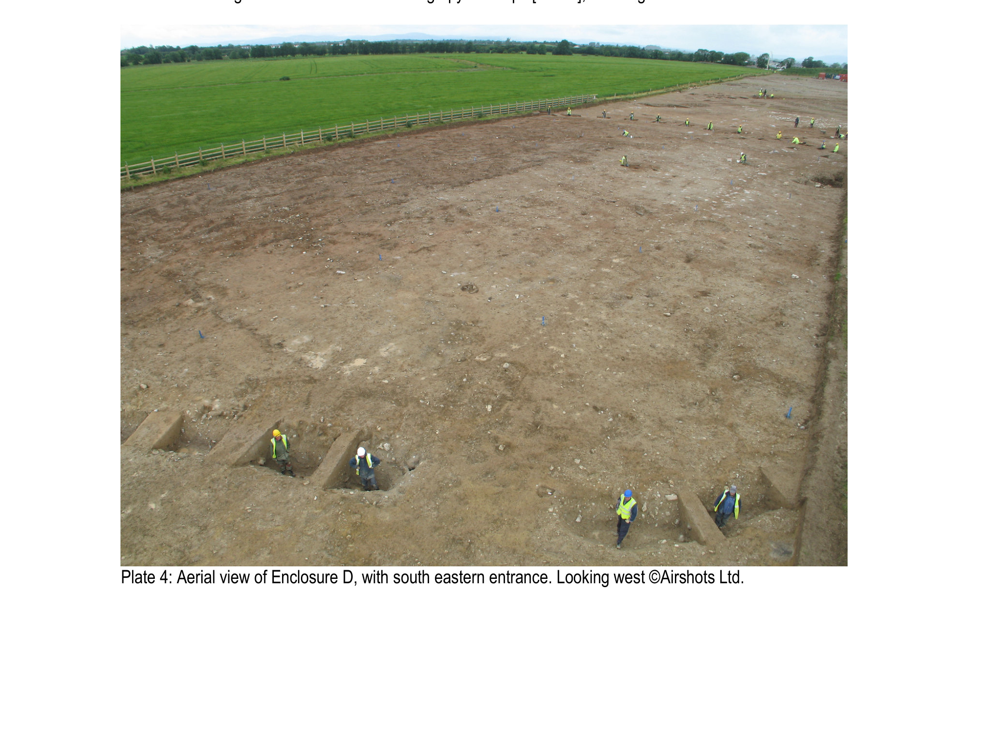
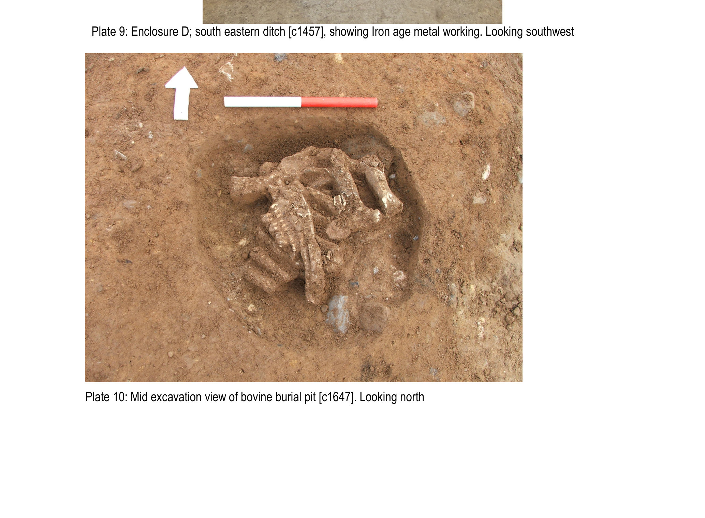
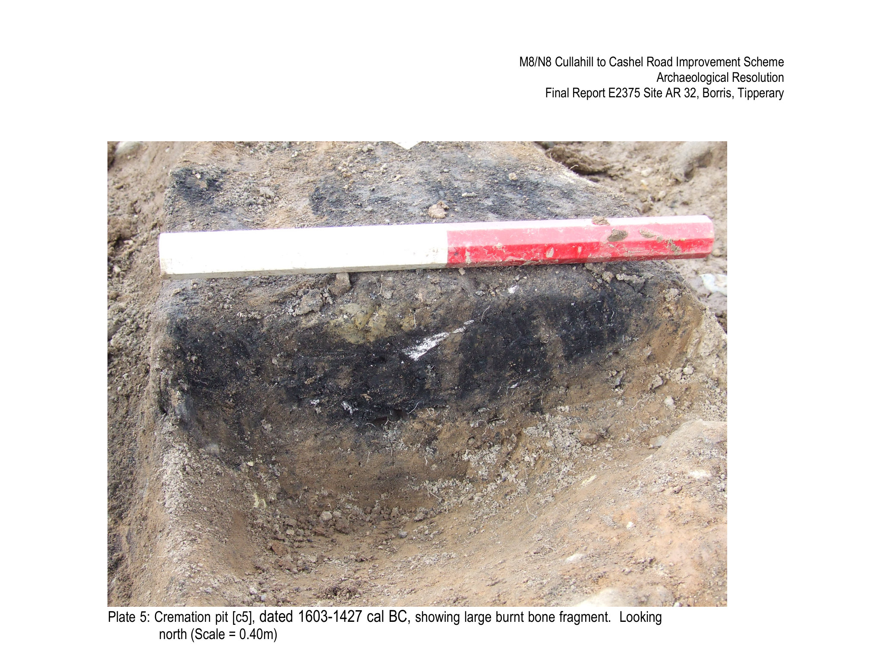

# Prehistoric Two Mile Borris

*5500 BC – AD 450*

The deep prehistory of this place is wetland country. The River Suir and its tributaries running south-west, the Slieveardagh hills west of that, and to the north and east the great Derryville and Littleton bogs. In prehistoric times the bogs were larger, wetter, and pretty much impassable. They were also full of food. Hunting, fowling and fishing happened in the wet places, and so did ritual deposits. An Iron Age shield of wood and leather was pulled out of a bog at Clonoura, and a possible female bog body was found at Newhill. Both within 5km of the village.

What we know about the people on this ground back then comes mainly from a string of seven archaeological digs along the line of the M8 motorway south and east of the village, worked through in 2006 and 2007 by Valerie J. Keeley Ltd ahead of construction. They all sit on slightly higher ground, with the land falling gently away to the Black River and the bogs beyond, and between them they cover well over a thousand years of the Bronze Age. People used different patches of the same parish in very different ways at different times.

For where each of these sits on the ground, the [village map](../map.md) has every dig site marked, with a Read More link to its own page.

## The big oval enclosure beside the river

*Aerial of Enclosure D at [AR 33](../places/dig_ar33.md), south-eastern entrance visible. Courtesy Airshots Ltd / Valerie J. Keeley Ltd / TII (placeholder).*

<h3>A 95-metre enclosure with a deliberate doorway</h3>

Late Bronze Age; ditch fills radiocarbon-dated 800-510 BC

On the east-facing slope above the Black River at [AR 33](../places/dig_ar33.md), the dig uncovered a Late Bronze Age oval enclosure 95 metres east to west. The entrance, 3.8 metres wide, faced south-east and was framed by a pair of large post-holes. The ditch was deeper and wider near that entrance than anywhere else, the kind of thing people do when they want a doorway to feel important.

The ditch fills near the entrance were waterlogged when excavated. A fragment of human skull came out of the northern terminus of the south-eastern ditch. Elsewhere along the ditch, low-intensity in-situ burning was visible, with charcoal and heat-shattered stone in varying concentrations. Whether the ditch was set alight in one big event or fires were lit in lots of small ones across many years, the dig couldn't say. A flint scraper was found in the burnt layer, and 90 kilograms of animal bone came out of the ditch fills.

??? note "About the cattle burial"

    Inside the enclosure, on the raised central area, sat a cluster of pits and post-holes that were not a house. Their upper fills were charcoal-rich. The find that stops you in your tracks, though, is the single deliberate cattle burial.

    Selected bones of a mature animal, around twelve years old, had been placed in three or four overlapping crisscrossed layers in a small shallow pit about two-thirds of a metre across. Three small wooden stakes had been driven into the ground first, then the bones were arranged on top.

    Cattle bone shows up on prehistoric sites all the time, but a deliberate, structured deposition like this inside a ritual enclosure is rare. Keeping an animal to twelve, which is old for a Bronze Age cow, says something about her value beyond meat or milk. Whatever this animal meant to the people who buried her, she clearly mattered.

*The cow burial inside Enclosure D at [AR 33](../places/dig_ar33.md): mature cow bones placed in crisscrossed layers on three small wooden stakes. Courtesy Valerie J. Keeley Ltd / TII (placeholder).*

## A roundhouse for seven people and a dog

<h3>The Middle Bronze Age roundhouse at AR 31</h3>

Middle Bronze Age; radiocarbon-dated 1607-1451 cal BC

Up on the higher ground at the western end of the dig, in Borris townland, where the line of the new N75 link road crossed a small ridge, the diggers found a wattle-and-timber roundhouse 6.8 metres across, with an annex or porch on its east side and a south-east facing entrance. Later ploughing had taken the floor levels, but the foundation slot trench, 21 internal post-holes and 70 stake-holes all survived. No hearth.

The excavation team's own description of the size: a roundhouse this big could "comfortably accommodate seven people (and a dog)". A nearly identical Middle Bronze Age house at Killoran 8, about 10 km north of here, has been dated to the same period.

This was where everyday Bronze Age life was happening at [AR 31](../places/dig_ar31.md) at roughly the same time as something stranger was being done up the road at Enclosure D. Well above the floodplain, in open fields, ordinary domestic.

## The flat cremation cemeteries

*A cremation pit at [AR 32](../places/dig_ar32.md), dated 1603-1427 cal BC. Courtesy Valerie J. Keeley Ltd / TII (placeholder).*

The Bronze Age dead were dealt with at two flat cremation cemeteries on what is now plough ground south and south-east of the village.

The earlier of the two, at [AR 36](../places/dig_ar36.md), held 13 pits containing the cremated remains of 13 individuals, with a further 5 pits read as cenotaphs or "blind" burials. Radiocarbon dates put the burials between 2204-2038 and 2024-1896 cal BC, an Early Bronze Age range that overlaps with the burnt-mound trough at AR 35 nearby.

A later cemetery at [AR 32](../places/dig_ar32.md) was a tight 12 by 15 metre cluster of 9 cremation pits and 11 blind cenotaph pits, dating to the Middle Bronze Age (radiocarbon dates 1619-1454, 1603-1427 and 1492-1322 cal BC). The lovely thing about its layout is that, except for one case, none of the pits cut into each other. So the cemetery must have been clearly marked above ground, probably with stakes, small stones or wooden posts. The upper fill of one pit actually held a posthole, which seals it.

Cremated bone, careful enclosing pits, and a habit of coming back to the same patches of ground over generations: people had ideas about where the dead belonged, and they stuck to them.

## The burnt mounds

A burnt mound, *fulacht fiadh* in Irish, is one of the most common prehistoric site types you find anywhere in the country. The recipe is a sunken wooden trough, a fireplace alongside it to heat large stones red-hot, and a low horseshoe-shaped mound of cracked, fire-shattered stones that builds up next to the trough over years of repeated use. What people were actually doing in the troughs is still argued about: cooking, brewing, washing wool, dyeing and ritual bathing have all been proposed. Whatever they were, they were popular, and they were everywhere from roughly 2500 BC to 1000 BC.

Two adjacent burnt-mound sites turned up on the same low rise on the M8 alignment. [AR 35](../places/dig_ar35.md) had two sub-areas about 30 metres apart, with troughs dating to the late Neolithic / Early Bronze Age transition (2486-2299 cal BC) and to the Middle Bronze Age (1880-1660 cal BC). [AR 37](../places/dig_ar37.md) added three more groups of features, including a Middle Bronze Age trough (1740-1520 cal BC) and a trough under a separate burnt mound (1367-1129 cal BC).

Across about 1,500 years of the Bronze Age, people farmed the higher ground in timber roundhouses, boiled water on hot stones at the burnt mounds, buried their cremated dead in carefully kept flat cemeteries on south-facing slopes, and at some point in the Late Bronze Age built a 95-metre enclosure beside the river and laid an old cow to rest inside it. The wetlands all around were where things, and probably people, were given to the water on purpose. It is a long way from the village we have now, but the people who chose this patch of ground at the meeting of the river and the small stream kept choosing it.

If you have a family story about ploughing up something strange in any of those fields, or a photograph from the M8 line being cut, the committee would love to see it. Drop us a line at [info@tmbvillage.ie](mailto:info@tmbvillage.ie).

  <a href="../">
    ← Back to
    Heritage overview
  </a>
  <a href="../early-medieval/" class="nav-next">
    Next era →
    Early Medieval (AD 450 – 1169)
  </a>

