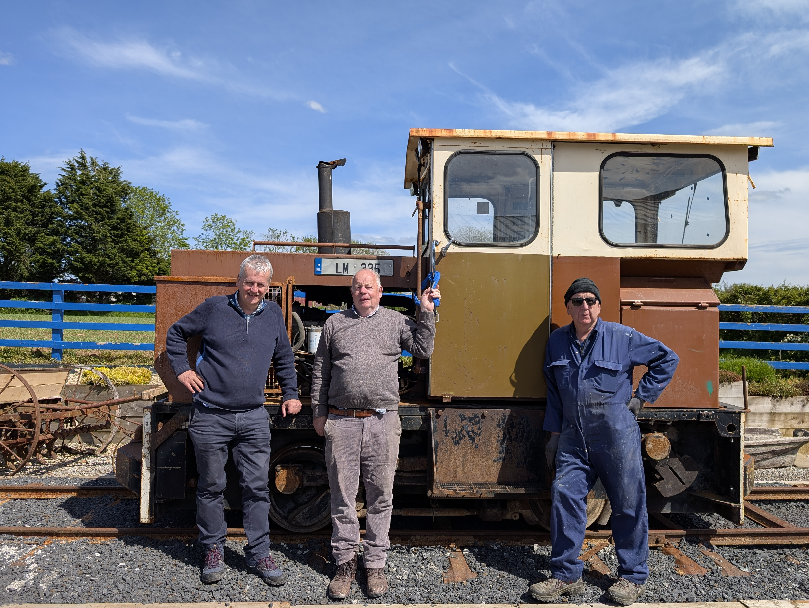

The Two-Mile-Borris Transport Museum sits on the eastern edge of the village and it's the work of one man, **Eamonn Medley**, who has been quietly building it up since 2016 into one of the real curiosities of the parish. The collection now runs to 18 vehicles ranging from the 1930s right through to the 1970s, alongside a brilliant section of transport memorabilia, and of course the Bord na Móna engine out at the front. Eamonn opens the gates for events or on demand whenever a village group comes looking for somewhere to gather, and he is incredibly generous with his time. He's also heavily involved in Thurles Lions Club, and between the Lions and the museum a steady stream of car shows and coffee mornings has rolled through the yard, with the proceeds shared out among the village's community groups, the graveyard group included.

The locomotive at the front is a cracker. Bord na Móna LM 336, sat on its own stretch of reassembled track, saved from the scrap pile and brought to the village by Eamonn. She's a Hunslet-built "Wagonmaster", a 3-foot-gauge diesel that spent her working life shifting peat on the bogs at Allenwood in Co. Kildare and then Derrygreenagh in Co. Offaly. Bord na Móna's rail operations ran their very last train in March 2024, so a working-era engine sat on its own length of track is genuinely the tail-end of a chapter of Irish industrial heritage, and Eamonn has one of them. The kind of thing visitors do not expect to find at the end of a country road.

From our side the gates and frontage are very much part of the village streetscape, and Eamonn keeps a pair of wooden planters either side dressed up to match the cohesive village planter scheme. They came into their own for our Vintage Coffee Morning, when Eamonn opened the gates for the day and the museum became the focal point of one of the year's community fundraisers.

If you're passing and the gates are open, push in and have a look. You won't regret it.

{{ place_photos("transport_museum") }}
