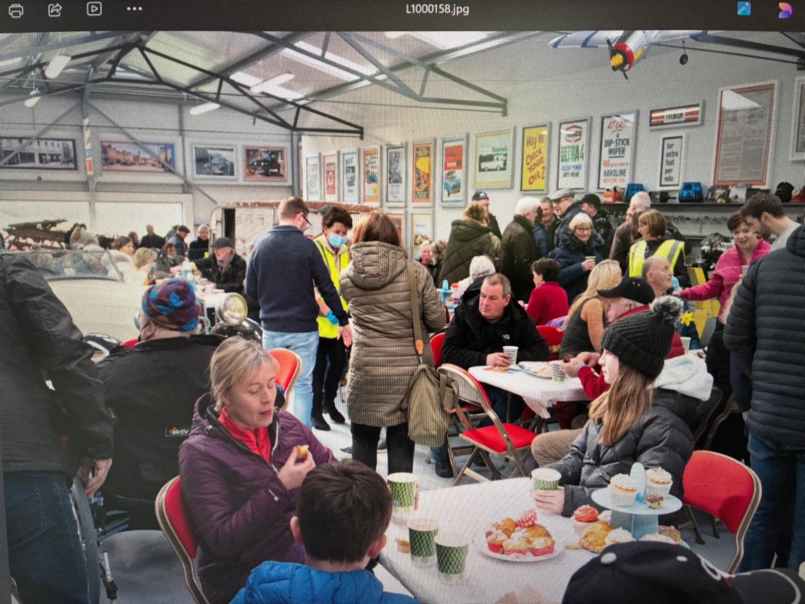
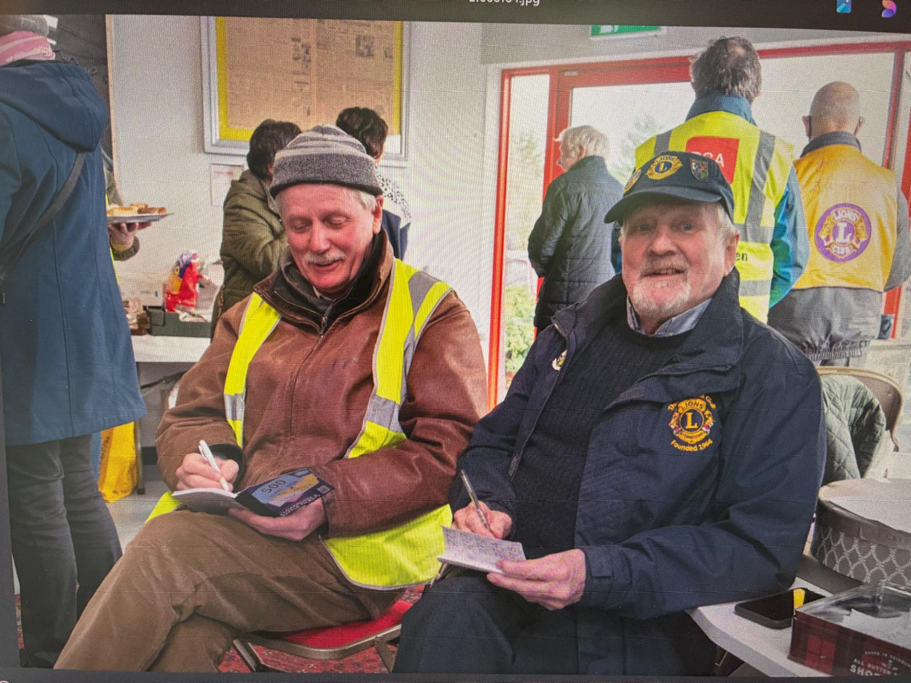
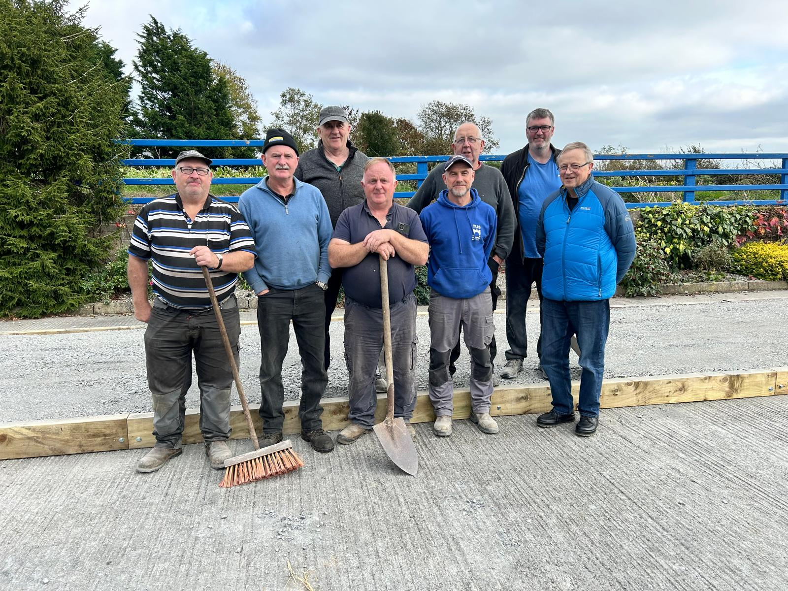

The Two-Mile-Borris Transport Museum sits on the eastern edge of the village and it's the work of one man, **Eamonn Medley**, who has been quietly building it up since 2016 into one of the real curiosities of the parish. The collection now runs to 18 vehicles ranging from the 1930s right through to the 1970s, alongside a brilliant section of transport memorabilia, and of course the Bord na Móna engine out at the front. Eamonn opens the gates for events or on demand whenever a village group comes looking for somewhere to gather, and he is incredibly generous with his time. He's also heavily involved in Thurles Lions Club, and between the Lions and the museum a steady stream of car shows and coffee mornings has rolled through the yard, with the proceeds shared out among the village's community groups, the graveyard group included.

The big one in the calendar is the **annual Vintage Coffee Morning**, hosted here at the museum and organised by Thurles Lions Club. First held in 2022, it now raises around €4,000 every year for local charities, with the museum gates thrown open for the day and a brilliant line-up of vintage cars rolled out under the rafters. This year's morning is set for Sunday 24th May 2026.

The Lions Club crew run the whole show, from the ticket table at the door to the tea station out the back, and the village turns out in force. Tables get pushed in between the cars, daffodils go down the middle, and the morning rolls along on tea, scones and chat. It's one of the best community gatherings of the year.

The locomotive at the front is a cracker. Bord na Móna LM 336, sat on its own stretch of reassembled track, saved from the scrap pile and brought to the village by Eamonn. She's a Hunslet-built "Wagonmaster", a 3-foot-gauge diesel that spent her working life shifting peat on the bogs at Allenwood in Co. Kildare and then Derrygreenagh in Co. Offaly. Bord na Móna's rail operations ran their very last train in March 2024, so a working-era engine sat on its own length of track is genuinely the tail-end of a chapter of Irish industrial heritage, and Eamonn has one of them. The kind of thing visitors do not expect to find at the end of a country road.

Getting the engine in took a proper bit of effort. The concrete pad was poured, the wooden edging bedded in and the track laid by a crew of local volunteers, and the photo of the crew lined up on the freshly finished apron with brooms and shovels in hand is one of the better behind-the-scenes shots the museum has.

From our side the gates and frontage are very much part of the village streetscape, and Eamonn keeps a pair of wooden planters either side dressed up to match the cohesive village planter scheme. They came into their own for our Vintage Coffee Morning, when Eamonn opened the gates for the day and the museum became the focal point of one of the year's community fundraisers.

If you're passing and the gates are open, push in and have a look. You won't regret it.

{{ place_photos("transport_museum") }}
