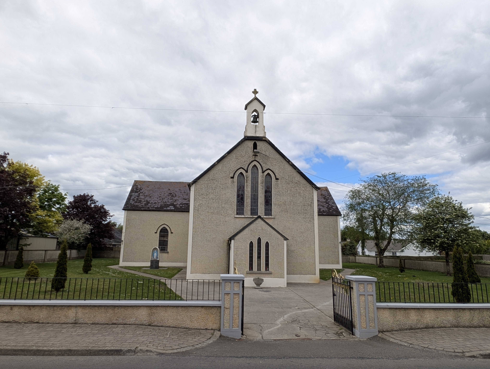
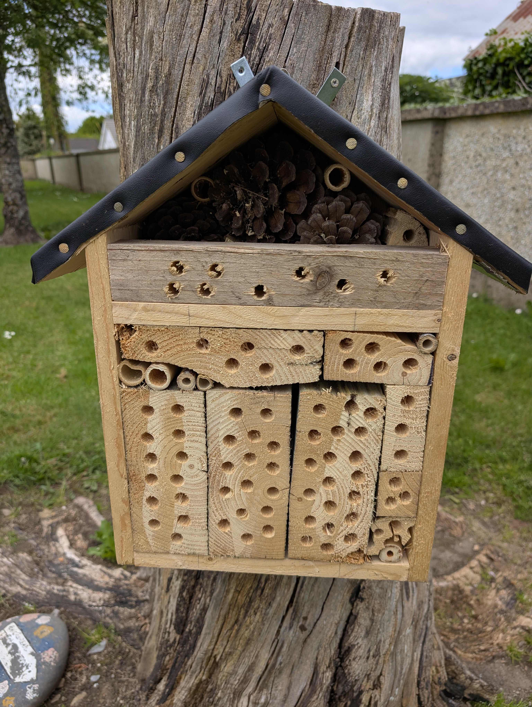
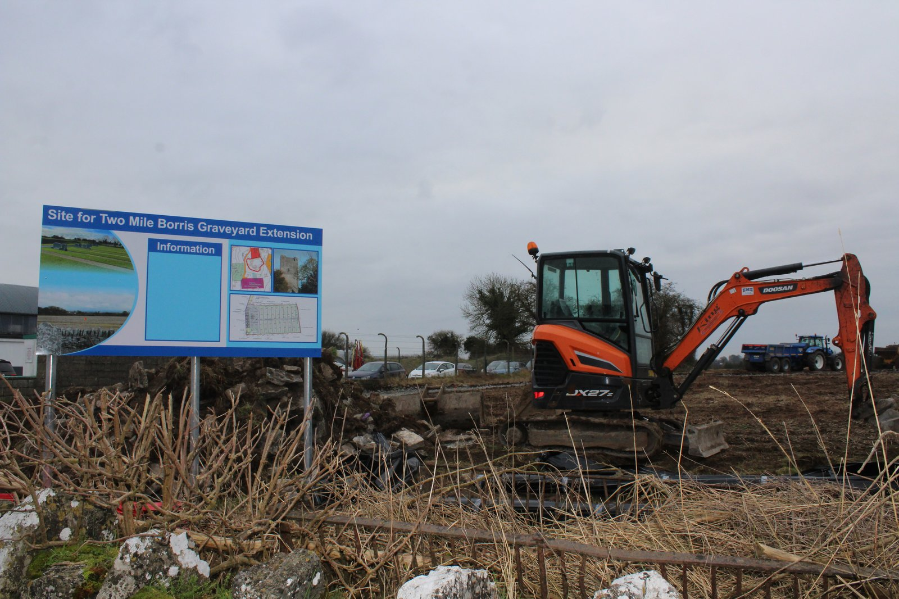

## What it is

In March 2023 the Irish Catholic Bishops' Conference asked parishes to manage 30% of church grounds for nature by 2030, in keeping with Laudato Si'. There's a Faith Community Pollinator Plan that sets out practical actions any parish can adopt, and a short repeatable insect survey (a Flower-Insect-Timed count) that builds up the parish's own record of pollinator life over the years.

<figure markdown>
{ width="600" }
<figcaption>Saint James Church on the main street, the calm centrepiece of the village (May 2026)</figcaption>
</figure>

## Where we are

We've started chatting with Father Tom about whether St James parish might join. The parish makes the call, and if it suits we'll help with the practical pieces.

There's already lovely work happening on the grounds: the unmown wildflower bed, the bug hotel we put together with the parish's blessing, and the new graveyard extension that we'd love to landscape for biodiversity (project 019). Joining would put a national programme name around what's already underway and give us a steady framework for the years ahead.

<figure markdown>
{ width="600" }
<figcaption>Our bug hotel in the church grounds, packed with pine cones, bamboo, drilled timber and reeds. Five-star accommodation for solitary bees, ladybirds and lacewings (May 2026)</figcaption>
</figure>

## What signing up would look like

- Identifying a 30% area across church grounds and graveyard to manage primarily for wildlife
- Adopting the Faith Community Pollinator Plan as the parish's management framework
- A yearly Flower-Insect-Timed count in May or June so we can see how pollinator life is doing
- A simple "managed for wildlife" sign so parishioners and visitors understand the intent
- A chat with the Tipperary County Council Biodiversity Officer about nest boxes for swifts and barn owls and any other practical help

<figure markdown>
{ width="600" }
<figcaption>The graveyard extension under construction in early 2025, lots of fresh ground to think about for the biodiversity planting in project 019 (Spring 2025)</figcaption>
</figure>

## Looking after the wildflower bed

The bed at the church grounds follows the [All-Ireland Pollinator Plan grassland guidance](https://pollinators.ie/grasslands/): let the native wildflowers come through from the existing seed bank rather than sowing in a commercial mix, keep dock and thistle in check between April and September, sign it so people know what it is, and cut and lift in autumn to keep the soil lean and the wildflowers happy.
