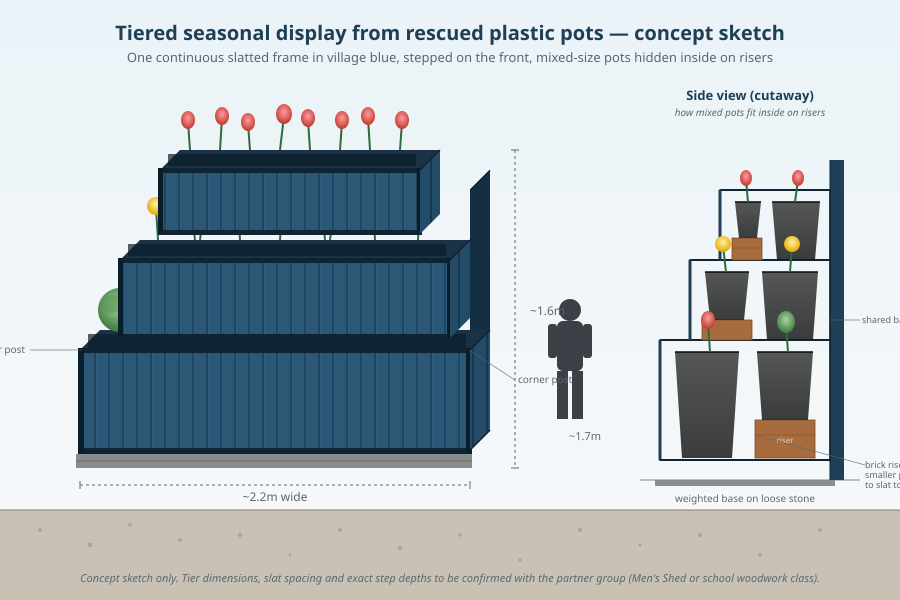

{ width="100%" }

**Lead:** Andy B.

## The idea

Every household with a garden ends up with the same problem. A pile of mixed plastic plant pots that came home with bedding plants, shrubs or trees, and never quite get used again. They're awkward sizes, they don't fit any kerbside recycling stream, and so they sit in sheds and gardens, or they go in the bin.

Pooled together inside a single tiered timber display, those random pots disappear from view. The design is a stepped, slatted box in village blue. Each tier is sized for the biggest pots (roughly 20L), and shorter pots sit on simple riser blocks inside so every rim lines up at the top of the slats. From the front you see painted timber and the planting; the mixed plastic underneath is hidden.

Sited at the car park opposite Tully's, it hits three things at once. It diverts a real waste stream, it gives a partner group (Thurles Men's Shed, the secondary school woodwork class, or similar) a real community build, and it puts a bit of colour at one of the busiest spots in the village.

## Seasonal planting

The mixed pot sizes open the planting up well beyond bulbs. Spring can still be the headline, tulips and daffodils packed into the smaller upper pots and larger drifts of mixed bulbs in the bottom row. Through summer the bigger pots carry shrubby herbs, dwarf hydrangea, geraniums or whatever cuttings the committee has spare. Autumn into winter the big pots take cyclamen, heather and dwarf evergreens. The biggest 20L containers could even hold a rosemary or a bay that lives there year-round.

## Why the car park opposite Tully's

It's the corner most people pass through on a normal day. A seasonal display there is seen by villagers doing the shop run rather than only by people deliberately visiting the green spaces. The site is open and visible enough that any vandalism would be noticed quickly, and the wall behind gives the structure something to sit against.

## Build notes (for whoever takes it on)

- **Slatted front and sides** so the pot bodies are hidden, with an open top frame the pots drop down into.
- **Each tier sized for the biggest pot** we'd want to take, around 20L (roughly 30cm across, 30cm tall). Smaller pots sit on simple timber or brick riser blocks inside so every rim lines up at the top of the slats.
- **Heavy enough that it can't be walked off.** Bolted to a base or weighted with concrete pavers inside the frame.
- **Treated softwood or, ideally, locally milled hardwood offcuts. Painted village blue.**
- **Drainage handled at the base.** The car park surface is loose stone so run-off soaks away naturally, but the base needs to sit flat and stable on it.

## What we'd need to line up first

1. **Council permission** for the car park siting. It's public ground so this isn't ours to decide.
2. **A build partner.** Thurles Men's Shed is the obvious first ask. If they're stretched, the secondary school woodwork or transition-year programme is the alternative.
3. **A planting budget or sponsor.** A modest annual spend on bulbs and bedding keeps it going. Worth asking a local supplier whether they'd donate or discount end-of-season stock.
4. **A pot-collection point** so households know where to drop their used pots through the year.

## Inspiration

The Dutch designer **Jacqueline van der Kloet** is well known for tiered and layered seasonal displays at Keukenhof and elsewhere; her work is the visual reference for what this could feel like at village scale. We're not trying to recreate Keukenhof in a TMB car park, but the idea of pooling lots of containers into one striking staged display is hers.
